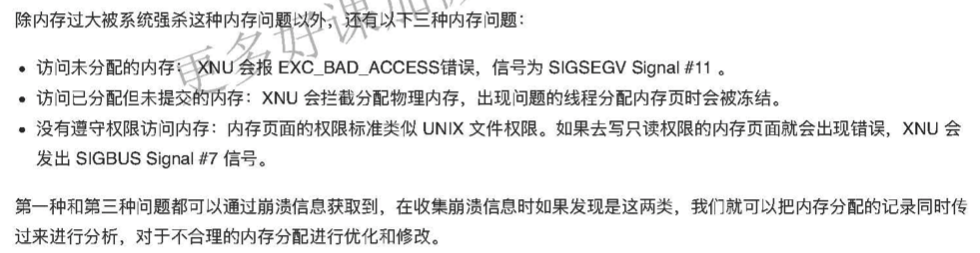

# APM应用性能监控

### 1. 崩溃
#### 1.1 应用崩溃的原因
* **数组越界**:在取数据索引时越界，App会发生崩溃。还有一种情况，就是给数组添加了`nil`会崩溃。
* **多线程问题**:在子线程中进行`UI`更新可能会发生崩溃。多个线程进行数据的读取操作，因为处理时机不一致，比如有一个 线程在置空数据的同时另一个线程在读取这个数据，可能会出现崩溃情况。
* **主线程无响应**:如果主线程超过系统规定的时间无响应，就会被`Watchdog`杀掉。这时，崩溃问题对应的异常编码是 `0x8badf00d`。
* **野指针**:指针指向一个已删除的对象访问内存区域时，会出现野指针崩溃。野指针问题是需要我们重点关注的，因为它是导致App崩溃的最常⻅，也是最难定位的一种情况。


#### 1.2 如何收集崩溃
**信号可捕获的崩溃日志收集**
1. 提交`AppStore`时选上“`Upload your app’s symbols to receive symbolicated reports from Apple`”，以后你就可以直接在`Xcode`的`Archive`里看到符号化后的崩溃日志了
2. [PLCrashReporter](https://www.plcrashreporter.org/)(需要上传服务端);数据不敏感则用[Fabric](https://get.fabric.io/)或[Bugly](https://bugly.qq.com/v2/);

信号的种类有很多，但是都可以 通过注册`signalHandler`来捕获到。其实现代码，如下所示:
```
void registerSignalHandler(void) {
  signal(SIGSEGV, handleSignalException);
  signal(SIGFPE, handleSignalException);
  signal(SIGBUS, handleSignalException);
  signal(SIGPIPE, handleSignalException);
  signal(SIGHUP, handleSignalException);
  signal(SIGINT, handleSignalException);
  signal(SIGQUIT, handleSignalException);
  signal(SIGABRT, handleSignalException);
  signal(SIGILL, handleSignalException);
}

void handleSignalException(int signal) {
NSMutableString *crashString = [[NSMutableString alloc]init]; void* callstack[128];
int i, frames = backtrace(callstack, 128);
char** traceChar = backtrace_symbols(callstack, frames);

for (i = 0; i <frames; ++i) {
	[crashString appendFormat:@"%s\n", traceChar[i]];
	}
	NSLog(crashString);
}
```

**信号捕获不到的崩溃信息收集**

首先了解一下iOS`后台保活`的5种方式:
* 使用 `Background Mode`方式的话，App Store在审核时会提高对App 的要求。通常情况下，只有那些地图、音乐播放、 VoIP 类的 App 才能通过审核。
* `Background Fetch`方式的唤醒时间不稳定，而且用户可以在系统里设置关闭这种方式，导致它的使用场景很少。
* `Silent Push` 是推送的一种，会在后台唤起 App 30秒。它的优先级很低，会调用 application:didReceiveRemoteNotifiacation:fetchCompletionHandler: 这个 delegate，和普通的 remote push notification 推送调用的 delegate 是一样的。
* `PushKit` 后台唤醒 App 后能够保活30秒。它主要用于提升 VoIP 应用的体验。
* `Background Task` 方式，是使用最多的。App 退后台后，默认都会使用这种方式。

```
//Background Task方式的使用方法
- (void)applicationDidEnterBackground:(UIApplication *)application {
self.backgroundTaskIdentifier = [application beginBackgroundTaskWithExpirationHandler:^( void) {
        [self yourTask];
    }];
}
```
yourTask 任务最多执行3分钟，3分钟内 yourTask 运行完成，你的 App 就会挂起。 如果 yourTask 在3分钟之 内没有执行完的话，系统会强制杀掉进程，从而造成崩溃，这就是为什么App退后台容易出现崩溃的原因。

#### 1.3 解决崩溃方法
我们采集到的崩溃日志，主要包含的信息为:
* **进程信息**:崩溃进程的相关信息，比如崩溃报告唯一标识符、唯一键值、设备标识;
* **基本信息**:崩溃发生的日期、iOS 版本;
* **异常信息**:异常类型、异常编码、异常的线程;
* **线程回溯**:崩溃时的方法调用栈。

完整的崩溃日志里，除了线程方法调用栈还有异常编码。你可以在维基百科上，查看[完整的异常编码](https://en.wikipedia.org/wiki/Hexspeak)。这里列出了44种异常 编码，但常⻅的就是如下三种:
* `0x8badf00d`，表示 App 在一定时间内无响应而被`watchdog`杀掉的情况。
* `0xdeadfa11`，表示App被用户强制退出。
* `0xc00010ff`，表示App因为运行造成设备温度太高而被杀掉。

* [iOS crash 问题分析汇总](https://blog.csdn.net/kyl282889543/article/details/85675138)

### 2. 卡顿
#### 2.1 原因
* 复杂 UI 、图文混排的绘制量过大;
* 在主线程上做网络同步请求;
* 在主线程做大量的IO 操作;
* 运算量过大，CPU持续高占用;
* 死锁和主子线程抢锁。

#### 2.2 RunLoop监测卡顿
#### 2.2.1 原理
> **第一步**
通知 `observers`:`RunLoop` 要开始进入 `loop` 了。紧接着就进入 `loop`。

代码如下:
```
//通知 observers
if (currentMode->_observerMask & kCFRunLoopEntry )
__CFRunLoopDoObservers(runloop, currentMode, kCFRunLoopEntry);
//进入 loop
result = __CFRunLoopRun(rl, currentMode, seconds, returnAfterSourceHandled, previousMode);
```
> **第二步**
开启一个 `do while` 来保活线程。通知 `Observers`:`RunLoop` 会触发 `Timer` 回调、`Source0` 回调，接着执行加入的 `block`。

代码如下:
```
// 通知 Observers RunLoop 会触发 Timer 回调
if (currentMode->_observerMask & kCFRunLoopBeforeTimers)
__CFRunLoopDoObservers(runloop, currentMode, kCFRunLoopBeforeTimers);

// 通知 Observers RunLoop 会触发 Source0 回调
if (currentMode->_observerMask & kCFRunLoopBeforeSources)
__CFRunLoopDoObservers(runloop, currentMode, kCFRunLoopBeforeSources);

// 执行 block
__CFRunLoopDoBlocks(runloop, currentMode);
```
接下来，触发 `Source0` 回调，如果有 `Source1` 是 `ready` 状态的话，就会跳转到 `handle_msg`去处理消息。代码如下:
```
if (MACH_PORT_NULL != dispatchPort ) {
    Boolean hasMsg = __CFRunLoopServiceMachPort(dispatchPort, &msg)
    if (hasMsg) goto handle_msg;
}
```

> **第三步**
回调触发后，通知 `Observers`:`RunLoop`的线程将进入休眠(`sleep`)状态。

代码如下:
```
Boolean poll = sourceHandledThisLoop || (0ULL == timeout_context->termTSR);
if (!poll && (currentMode->_observerMask & kCFRunLoopBeforeWaiting)) {
    __CFRunLoopDoObservers(runloop, currentMode, kCFRunLoopBeforeWaiting);
}
```

> **第四步**
进入休眠后，会等待 `mach_port` 的消息，以再次唤醒。只有在下面四个事件出现时才会被再次唤醒:
* 基于 `port` 的 `Source` 事件
* `Timer` 时间到
* `RunLoop` 超时
* 被调用者唤醒

等待唤醒的代码如下:
```
do {
    __CFRunLoopServiceMachPort(waitSet, &msg, sizeof(msg_buffer), &livePort) {
        // 基于 port 的 Source 事件、调用者唤醒
        if (modeQueuePort != MACH_PORT_NULL && livePort == modeQueuePort) {
            break;
        }
        // Timer 时间到、RunLoop 超时
        if (currentMode->_timerFired) {
            break;
        }
} while (1);
```

> 第五步
唤醒时通知 `Observer`:`RunLoop` 的线程刚刚被唤醒了。

代码如下:
```
if (!poll && (currentMode->_observerMask & kCFRunLoopAfterWaiting)) __CFRunLoopDoObservers(runloop, currentMode, kCFRunLoopAfterWaiting);
```

> 第六步
`RunLoop` 被唤醒后就要开始处理消息了:
* 如果是 `Timer` 时间到的话，就触发 `Timer` 的回调;
* 如果是 `dispatch` 的话，就执行 `block`;
* 如果是 `source1`事件的话，就处理这个事件。
消息执行完后，就执行加到 `loop` 里的 `block`。

代码如下:
```
handle_msg:
// 如果 Timer 时间到，就触发 Timer 回调
if (msg-is-timer) {
    __CFRunLoopDoTimers(runloop, currentMode, mach_absolute_time())
 }

// 如果 dispatch 就执行 block
else if (msg_is_dispatch) {
    __CFRUNLOOP_IS_SERVICING_THE_MAIN_DISPATCH_QUEUE__(msg);
}

// Source1 事件的话，就处理这个事件
else {
    CFRunLoopSourceRef source1 = __CFRunLoopModeFindSourceForMachPort(runloop, currentMode, livePort); sourceHandledThisLoop = __CFRunLoopDoSource1(runloop, currentMode, source1, msg);
    if (sourceHandledThisLoop) {
        mach_msg(reply, MACH_SEND_MSG, reply);
    }
}
```

> 第七步
根据当前`RunLoop`的状态来判断是否需要走下一个`loop`。当被外部强制停止或`loop`超时时，就不继续下一个`loop`了，否则继续走下一个`loop`。

代码如下:
```
if (sourceHandledThisLoop && stopAfterHandle) {
      // 事件已处理完
    retVal = kCFRunLoopRunHandledSource;
} else if (timeout) {
    // 超时
    retVal = kCFRunLoopRunTimedOut;
} else if (__CFRunLoopIsStopped(runloop)) {
    // 外部调用者强制停止
    retVal = kCFRunLoopRunStopped;
} else if (__CFRunLoopModeIsEmpty(runloop, currentMode)) {
    // mode 为空，RunLoop 结束
    retVal = kCFRunLoopRunFinished;
}
```
整个`RunLoop`过程，如下所示:


#### 2.2.2 如何监控
要想监听 RunLoop，你就首先需要创建一个 CFRunLoopObserverContext 观察者，代码如下:
```
CFRunLoopObserverContext context = {0,(__bridge void*)self,NULL,NULL};
runLoopObserver = CFRunLoopObserverCreate(kCFAllocatorDefault,
                                              kCFRunLoopAllActivities,
                                              YES,
                                              0,
                                              &runLoopObserverCallBack,
                                              &context);
```
将创建好的观察者`runLoopObserver`添加到主线程 `RunLoop` 的 `common` 模式下观察。然后，创建一个持续的子线程专⻔用来监控主线程的 `RunLoop`状态。
一旦发现进入睡眠前的 `kCFRunLoopBeforeSources` 状态，或者唤醒后的状态 `kCFRunLoopAfterWaiting`，在设置的时间阈值 内一直没有变化，即可判定为卡顿。接下来，我们就可以 `dump` 出堆栈的信息，从而进一步分析出具体是哪个方法的执行时间过⻓。
```
//创建子线程监控
dispatch_async(dispatch_get_global_queue(0, 0), ^{
	//子线程开启一个持续的 loop 用来进行监控
	while (YES) {
    long semaphoreWait = dispatch_semaphore_wait(dispatchSemaphore, dispatch_time(DISPATCH_TIME_NOW, 3*NSEC_PER_MSEC));
    if (semaphoreWait != 0) {
			if (!runLoopObserver) {
				timeoutCount = 0;
				dispatchSemaphore = 0;
				runLoopActivity = 0;
				return;
		    }
		    //BeforeSources 和 AfterWaiting 这两个状态能够检测到是否卡顿
			if (runLoopActivity == kCFRunLoopBeforeSources || runLoopActivity == kCFRunLoopAfterWaiting) {
				//将堆栈信息上报服务器的代码放到这里
			} //end activity
		}// end semaphore wait
		timeoutCount = 0;
	}// end while
});

```

其实，触发卡顿的时间阈值，我们可以根据`WatchDog`机制来设置。`WatchDog`在不同状态下设置的不同时间，如下所示:
* 启动(Launch):`20s`;
* 恢复(Resume):`10s`;
* 挂起(Suspend):`10s`;
* 退出(Quit):`6s`;
* 后台(Background):`3min`(在iOS 7之前，每次申请`10min`; 之后改为每次申请`3min`，可连续申请，最多申请到`10min`)。
通过`WatchDog`设置的时间，我认为可以把启动的阈值设置为10秒，其他状态则都默认设置为3秒。总的原则就是，要小于`WatchDog`的限制时间。

#### 2.3 获取卡顿的方法堆栈信息
* **直接调用系统函数**。
这种方法的优点在于，性能消耗小。但是，它只能够获取简单的信息，也没有 办法配合 dSYM 来获取具体是哪行代码出了问题，而且能够获取的信息类型也有限。这种方法，因为性能比较好，所以适用 于观察大盘统计卡顿情况，而不是想要找到卡顿原因的场景。
主要思路是:用 `signal` 进行错误信息的获取。

* **直接用[`PLCrashReporter`](https://opensource.plausible.coop/src/projects/PLCR/repos/plcrashreporter/browse)这个开源的第三方库来获取堆栈信息**。
这种方法的特点是，能够定位到问题代码的具体位置，而且性能消耗也不大。所以，也是我推荐的获取堆栈信息的方法。

### 3. 内存
**OOM**(`Out of Memory`)是App占用内存达到了iOS系统对单个App占用内存上限后,而被系统强杀掉的现象;
这种由于`iOS`的`Jetsam`机制导致的一种另类"崩溃", 而且日志无法通过信号捕捉到;

`Jetsam`机制:指的就是操作系统为了控制内存资源过度使用而采用的一种资源管控机制;

#### 3.1 如何获取内存限制值
* 通过`JetsamEvent`日志计算内存限制值;(可以从设置->隐私->分析中看到这些日志)
* 通过`XNU`获取内存上限值(需要root权限, 而App内的权限是不够的, 除非越狱获取这个权限)
* 通过内存警告获取内存限制值(利用`didReceiveMemoryWarning`这个内存压力代理事件来动态获取内存限制值)
iOS系统在强杀App之前还有`6s`时间, 足够去获取内存信息了.
系统提供一个函数`task_info`, 代码里面的`task_info_t`结构体包含了`resident_size`字段,代表使用了多少内存, 这样就可以在发生内存警告的时候获取当前`App`占用了多少内存.代码如下:
```
  float used_mem = info.resident_size;
  NSLog(@"使用了 %f MB 内存", used_mem / 1024.0f / 1024.0f);
```

#### 3.2 小结
为了达到监控的目的, 需要做两件事:
* 能够根据不同机器和系统获取到内存有问题的那个时间点
* 到那个时间点, 可以获取到足够多可以分析内存问题的信息

macOS没有强杀系统应用是因为手持设备存储空间小, 所以在iOS系统里去掉了交换空间, 这样就没法记录到外部设备上.但是苹果引入了`MemoryStatus`机制.
思路就是在iOS系统中弹出尽可能多的内存供当前应用使用.优先级是先强杀后台应用;如果内存还不够就强杀掉当前应用.而在macOS系统中, `MemoryStatus`只会强杀掉标记为空闲退出的进程.
在实现上`MemoryStatus`机制会开启一个`memorystatus_jetsam_thread`的线程, 这个线程和内存压力检测线程`vm_preasure_monitor`没有联系, 只负责强杀应用和记录日志, 不会发送消息, 所以内存压力检测线程无法获取到强杀应用线程的消息.



### 4. 耗电量
#### 4.1 如何获取电量
在iOS中，`IOKit framework` 是专⻔用于跟硬件或内核服务通信的。所以，我们可以通过`IOKit framework` 来获取硬件信息，进而获取到电量消耗信息。

#### 4.2 如何诊断电量问题
回到最开始的问题，当你用排除法将所有功能注释掉后，如果还有问题，那么这个耗电一定是由其他线程引起的。创建这个耗 电线程的地方可能是在其他地方，比如是由第三方库引起，或者是公司其他团队开发的二方库。
通过下面的这段代码，你就可以获取到所有线程的信息:
```
    thread_act_array_t threads;
    mach_msg_type_number_t threadCount = 0;
    const task_t thisTask = mach_task_self();
    kern_return_t kr = task_threads(thisTask, &threads, &threadCount);
```

`threads` 数组里的线程信息结构体 `thread_basic_info` 里有一个记录 `CPU` 使用百分比的字段 `cpu_usage`。`thread_basic_info`结构体中包含`cpu_usage`(`CPU`使用百分比), 有了这个 `cpu_usage` 字段，你就可以通过遍历所有线程，去查看是哪个线程的 `CPU` 使用百分比过高了。如果某个线程的 `CPU`使用率⻓时间都比较高的话，比如 **超过了90%**，就能够推断出它是有问题的。

多线程 `CPU` 使用率检查的完整代码如下:
```
// 轮询检查多个线程 CPU 情况 + (void)updateCPU {
    thread_act_array_t threads;
    mach_msg_type_number_t threadCount = 0;
    const task_t thisTask = mach_task_self();
    kern_return_t kr = task_threads(thisTask, &threads, &threadCount);
    if (kr != KERN_SUCCESS) {
        return;
    }
    for (int i = 0; i < threadCount; i++) {
        thread_info_data_t threadInfo;
        thread_basic_info_t threadBaseInfo;
        mach_msg_type_number_t threadInfoCount = THREAD_INFO_MAX;
        if (thread_info((thread_act_t)threads[i], THREAD_BASIC_INFO, (thread_info_t)threadInfo, &threadInfoCou
        threadBaseInfo = (thread_basic_info_t)threadInfo; if (!(threadBaseInfo->flags & TH_FLAGS_IDLE)) {
            integer_t cpuUsage = threadBaseInfo->cpu_usage / 10; if (cpuUsage > 90) {
            //cup 消耗大于 90 时打印和记录堆栈
            NSString *reStr = smStackOfThread(threads[i]);
            //记录数据库中
            [[[SMLagDB shareInstance] increaseWithStackString:reStr] subscribeNext:^(id x) {}]; NSLog(@"CPU useage overload thread stack:\n%@",reStr);
        } }
    } }
}
```

#### 4.3 原因
* `CPU`处理大量数据的复杂计算
对 `CPU` 的使用要精打细算，要避免让 `CPU` 做多余的事情。对于大量数据的复杂计算，应该把数据传到服务器去处理，如果 必须要在 `App` 内处理复杂数据计算，可以通过 GCD 的 `dispatch_block_create_with_qos_class` 方法指定队列的 `Qos` 为 `QOS_CLASS_UTILITY`，将计算工作放到这个队列的 `block` 里。在 `QOS_CLASS_UTILITY` 这种 `Qos` 模式下，系统针对大量数据的计算，以及复杂数据处理专⻔做了电量优化。
* 任何的 `I/O` 操作，都会破坏掉低功耗状态
业内的普遍做法是，将碎片化的数据磁盘存储操作延后，先在内存中聚合，然后再进行磁盘存储。碎片化的数据进行聚合，在
内存中进行存储的机制，可以使用系统自带的 `NSCache` 来完成。
`NSCache` 是线程安全的，`NSCache` 会在到达预设缓存空间值时清理缓存，这时会触发 `cache:willEvictObject:` 方法的回调， 在这个回调里就可以对数据进行 `I/O` 操作，达到将聚合的数据 `I/O` 延后的目的。`I/O` 操作的次数减少了，对电量的消耗也就减少了。
例如:SDWebImage读取缓存的时候就用的`NSCache`。

除了`CPU` 和 `I/O` 这两大耗电问题，还有什么要注意的呢?
苹果公司专⻔维护了一个电量优化指南“[Energy Efficiency Guide for iOS Apps](https://developer.apple.com/library/archive/documentation/Performance/Conceptual/EnergyGuide-iOS/)”，分别从 `CPU`、设备唤醒、网络、图形、动 画、视频、定位、加速度计、陀螺仪、磁力计、蓝牙等多方面因素提出了电量优化方面的建议。所以，当使用了苹果公司的电量优化指南里提到的功能时，严格按照指南里的最佳实践去做就能够保证这些功能不会引起不合理的电量消耗。

* [WWDC:Writing Energy Efficient Apps](https://developer.apple.com/videos/play/wwdc2017/238/)
