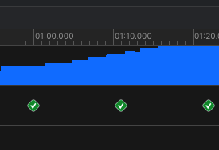

# Instrument工具
本篇打算介绍Xcode最强性能检测工具`Instrument`,有任何问题欢迎[issue](https://github.com/binzi56/iOSSmallKnowledgePool/issues);

## Leaks
### 内存泄漏三种场景对比
**区别:**
1. Strong reference

statistics
#Total#Persistent
一直累加
#Transient
0

页面反复push. pop

2. Block retain cycle

statistics
#Total#Persistent
一直累加
#Transient
0

点击❌位置

Leaks -> Cycles&Roots -> LeakCycles   (内存泄漏示意图)

Leaks -> Call Tree ->  Call Tree(invert call tree && Hide system libraries)

unNormal

normal
页面反复push. pop

3. NSTimer retain cycle

statistics
#Total#Persistent
一直累加
#Transient
0

页面反复push. pop

4.normal

退出界面dealloc立即调用

Allocation -> statistics ->  Allocation Summary

#Total
一直累加
#Persistent
一直保持1
#Transient
(#Total - #Persistent)
注: 退出界面消失

页面反复push. pop

**共同点:**

Allocation -> statistics ->  Allocation Summary

statistics
#Total#Persistent
一直累加
#Transient
0
退出界面后数据不会消失

组合:
Strong reference + Block retain cycle

## System Trace
## Time Proflier
