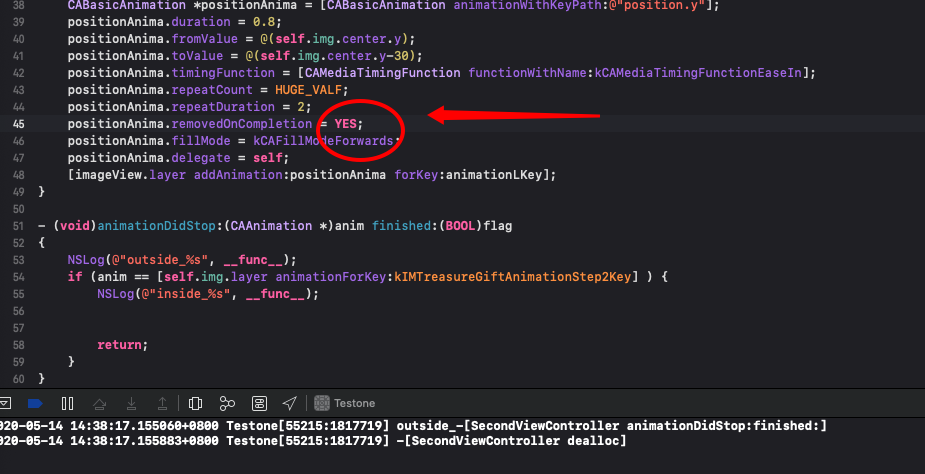
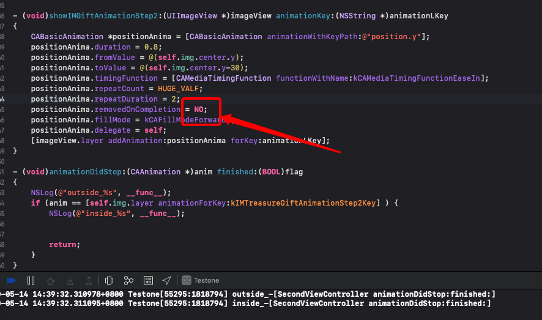

# 坑爹集锦
本篇打算介绍iOS中遇到的一些bug集锦, 有助于理解系统控件, 有任何问题欢迎[issue](https://github.com/binzi56/iOSSmallKnowledgePool/issues);

### 系统属性强代理造成的循环引用问题
`CABasicAnimationDelegate`
原生代码:
```
@property(nullable, strong) id <CAAnimationDelegate> delegate;
```
所以调用下面代码就会循环引用了
```
self.animation.delegate = self;
```

solution:
* [CABasicAnimation的使用](https://www.jianshu.com/p/be558802dc77)

注:
> 在`iOS`中存在一类`strong`类型的`delegate`, 比如`CoreAnimation`的代理和`NSURLSession`的代理. 使用强代理是因为动画和网络请求在异步执行, 而异步执行中随时可能会丢失销毁对象, 当执行完成之后再手动销毁对象. 因此要使用`strong delegate`, 必须当任务完完成时在将`delegate=nil`来释放`delegate`.

附:
`removedOnCompletion`值的使用影响:


