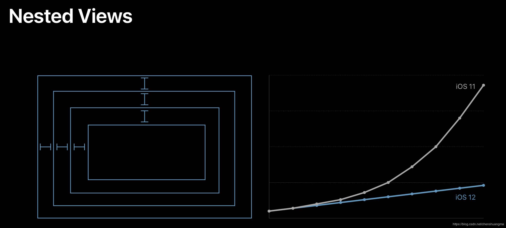

# 常用第三方库篇
### `matrix-iOS`
卡顿的原因:
* 复杂 UI 、图文混排的绘制量过大;
* 在主线程上做网络同步请求;
* 在主线程做大量的IO 操作;
* 运算量过大，CPU持续高占用;
* 死锁和主子线程抢锁。

检测原理:

`Matrix` 卡顿监控在 `Runloop` 的起始最开始和结束最末尾位置添加 `Observer`，从而获得主线程的开始和结束状态。卡顿监控起一个子线程定时检查主线程的状态，当主线程的状态运行超过一定阈值则认为主线程卡顿，从而标记为一个卡顿。
主要有两点:
* 主程序 `Runloop` 超时的阈值是 `2` 秒，子线程的检查周期是 `1` 秒。每隔 `1` 秒，子线程检查主线程的运行状态;
* `CPU` 过高也可能导致应用出现卡顿,目前采用单核 `CPU` 的占用超过了 `80%`即认为当前`CPU` 占用就过高;
* 线程过多造成卡顿(>64)，不用记录主线程堆栈;

```
- (void)addRunLoopObserver
{
    NSRunLoop *curRunLoop = [NSRunLoop currentRunLoop];

    // the first observer
    CFRunLoopObserverContext context = {0, (__bridge void *) self, NULL, NULL, NULL};
    CFRunLoopObserverRef beginObserver = CFRunLoopObserverCreate(kCFAllocatorDefault, kCFRunLoopAllActivities, YES, LONG_MIN, &myRunLoopBeginCallback, &context);
    CFRetain(beginObserver);
    m_runLoopBeginObserver = beginObserver;

    // the last observer
    CFRunLoopObserverRef endObserver = CFRunLoopObserverCreate(kCFAllocatorDefault, kCFRunLoopAllActivities, YES, LONG_MAX, &myRunLoopEndCallback, &context);
    CFRetain(endObserver);
    m_runLoopEndObserver = endObserver;
    ...
  }
```

下面这四点是能够让卡顿监控系统在对 `App` 性能损耗很小的情况下，更好地监控到线上 `App` 卡顿情况的四个细节:
* 子线程监控检测时间间隔:监控卡顿的子线程是通过 `NSThread` 创建的，检测时间间隔正常情况是`1`秒，在出现 卡顿情况下，间隔时间会受检测线程退火算法影响，按照 **斐波那契数列** 递增，直到没有卡顿时恢复为`1`秒。
* 子线程监控退火算法:避免一个卡顿会写入多个文件的情况。
* `RunLoop` 卡顿时间阈值设置:对于 `RunLoop` 超时阈值的设置，我在第13篇文章里建议设置为3秒，微信设置的是2秒。
* `CPU` 使用率阈值设置:当单核 `CPU` 使用率超过 `80%`，就判定 `CPU` 占用过高。`CPU` 使用率过高，可能导致 `App` 卡顿。

退火算法:

为了降低检测带来的性能损耗，在检测线程增加了退火算法：
* 每次子线程检查到主线程卡顿，会先获得主线程的堆栈并保存到内存中（不会直接去获得线程快照保存到文件中）；
* 将获得的主线程堆栈与上次卡顿获得的主线程堆栈进行比对：
   * 如果堆栈不同，则获得当前的线程快照并写入文件中；
   * 如果相同则会跳过，并按照斐波那契数列将检查时间递增直到没有遇到卡顿或者主线程卡顿堆栈不一样。

```
   if (bIsSame) {
       NSUInteger lastTimeInterval = m_nIntervalTime;
       m_nIntervalTime = m_nLastTimeInterval + m_nIntervalTime;
       m_nLastTimeInterval = lastTimeInterval;
       MatrixInfo(@"call stack same timeinterval = %lu", (unsigned long) m_nIntervalTime);
       return EFilterType_Annealing;
   } else {
     ...
   }
```

### `Texture`(`AsyncDisplayKit`)
造成`iOS`界面卡顿的原因有很多，总结一句话就是：
> CPU或GPU消耗过大，导致在一次同步信号之间没有准备完成，没有内容提交，导致掉帧的问题

还有例如`CPU` 的操作都会延迟 `GPU` 开始渲染的时间：
* 布局的计算 - 如果你的视图层级太过于复杂，或者视图需要重复多次进行布局，尤其是在使用 `Auto Layout` 进行自动布局时，对性能影响尤为严重；


可以看到在iOS12以前，视图嵌套的数量对性能的影响是呈指数级增长。优化后自动布局的性能基本上可以达到同手写布局一样，随着布局嵌套的量呈线性增长。至于其中的原因以及解决方法，可以参考WWDC 2018 中 [202 Session](https://developer.apple.com/videos/play/wwdc2018/202/) 的内容;
大致实际情况就是，iOS 12 之前，很多约束变化时都会重新创建一个计算引擎 `NSISEnginer` 将约束关系重新加进来，然后重新计算。导致涉及到的约束关系变多时，新的计算引擎需要重新计算，最终导致计算量呈指数级增加。(顺便说一句, 原有的`Cassowary`算法是呈线性的, iOS12之后更多地利用了`Cassowary`算法的界面更新策略，使其真正完成了高效的界面线性策略计算。)

* 视图的惰性加载 - 在 `iOS` 中只有当视图控制器的视图显示到屏幕时才会加载；
* 解压图片 - `iOS` 通常会在真正绘制时才会解码图片，对于一个较大的图片，无论是直接或间接使用 `UIImageView` 或者绘制到 `Core Graphics` 中，都需要对图片进行解压；
…
宽泛的说，大多数的 `CALayer` 的属性都是由 `GPU` 来绘制的，比如图片的圆角、变换、应用纹理；但是过多的几何结构、重绘、离屏绘制（`Offscrren`）以及过大的图片都会导致 `GPU` 的性能明显降低。


* [提升 iOS 界面的渲染性能](https://zhuanlan.zhihu.com/p/22255533?refer=iOS-Source-Code)
* [AsyncDisplayKit源代码解析](https://www.jianshu.com/p/21f3d46b1bc5)
