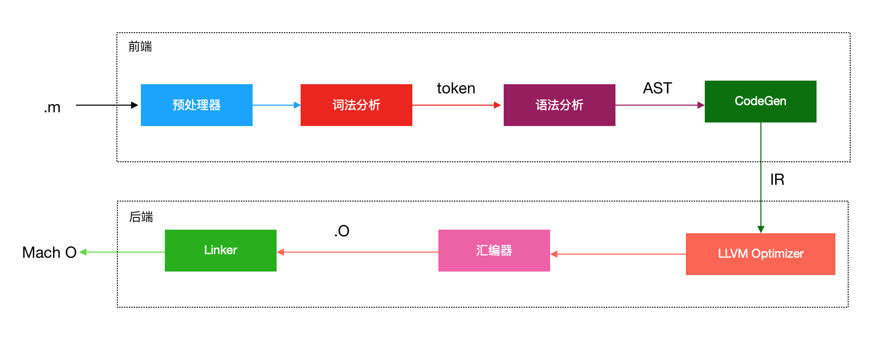
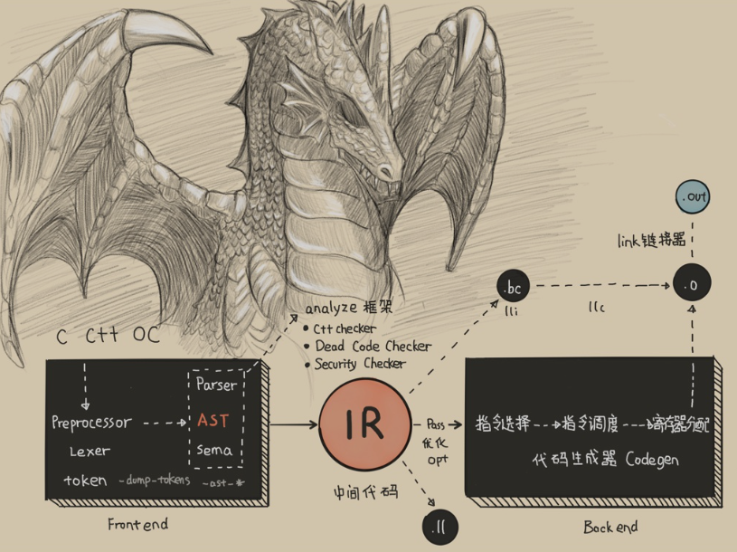

# 底层原理篇
本篇打算以边说概念边解问题的方式深入探讨iOS底层一些逻辑问题,有任何问题欢迎[issue](https://github.com/binzi56/iOSSmallKnowledgePool/issues);

### `@autoreleasepool`与`autorelease`
在开发中经常用`@autoreleasepool`来解决`autorelease`产生的内存问题;
举个🌰:
```
for (NSInteger i = 0; i < 10000000; i++) {
    @autoreleasepool {
        NSString *tempStr = [NSString stringWithFormat:@"临时变量"];
    }
}
```

简述
目前区分是否使用了`autorelease`按以下规律:
> 1. 使用alloc/new/copy/mutableCopy/init 创建临时对象直接返回被retain对象，不会进入autoreleasepool中;(具体看[ARC规定](https://clang.llvm.org/docs/AutomaticReferenceCounting.html#precise-lifetime-semantics), 实际使用上常见于一些对象的构造方法即类方法)
> 2. 使用其它方法创建的临时对象则会自动将返回的对象注册到池子中(注意:这里是自己不持有的对象);

再附一个`NSAutoreleasepool`的生命周期以供观赏:


Q1:`autorelease`因何存在?
在OC的内存管理机制中有一条规律是：谁申请，谁释放;
那么如果需要延长生命周期或者某个方法需要返回一个新建对象并在合适的时机来释放,此时就需要`autorelease`来应对这些情况,这样既能确保对象能正确释放，又能返回有效的对象。

Q2:`autorelease`和`@autoreleasepool`内部是如何实现的?
这里用[GNUstep源码](http://www.gnustep.org/resources/downloads.php)来解释;
```
//autorelease
- (id)autorelease
{
    [NSAutoreleasePool addObject:self];
}
```

```
//@autoreleasepool
+ (void)addobject:(id)anObj{
    NSAutoreleasePool *pool = 取得正在使用的NSAutoreleasePool对象;
    if (pool != nil){
        [pool addobject:an0bj];
    }else{
        NSLog ( @"NSAutoreleasePool对象非存在状态下调用autorelease");
    }
}

- (void)addObject:(id)anObj
{
    [pool.array addObject:anObj];
}
```
`autorelease`实例方法的本质就是调用`NSAutoreleasePool`对象的`addObject:`类方法，然后这个对象就被追加到正在使用的`NSAutoreleasePool`对象中的数组里。
当然这里只是选用GNUstep源码的解释, 实际Apple的实现则更为复杂;

**调用流程**
如果我们手动在代码外面再套一层`autorelease`，它就会被最近的`autoreleasepool`管理，一般是当前线程默认创建的`autoreleasepool`，此`autoreleasepool`的释放时机一般是当前`runloop`循环结束，所以会看到的现象就是内存一直飙升，然后断崖式下降。

其他相关的点:
使用容器的`block`版本的枚举器时，内部会自动添加一个`AutoreleasePool`;
```
[array enumerateObjectsUsingBlock:^(id obj, NSUInteger idx, BOOL *stop) {
    // 这里被一个局部@autoreleasepool包围着
}];
```

参考:
* [黑幕背后的Autorelease](http://blog.sunnyxx.com/2014/10/15/behind-autorelease/)
* [Revisit iOS Autorelease 之不经意间可能被影响的优化](https://www.sohu.com/a/336220048_208051)


### `Runtime Method Swizzling`原理
`Runtime Method Swizzling` 编程方式，也可以叫作`AOP`(`Aspect-Oriented Programming`，面向切面编程)。
`AOP` 是一种编程范式，也可以说是一种编程思想，使用 `AOP` 可以解决 `OOP`(`Object Oriented Programming`，面向对象编
程)由于切面需求导致单一职责被破坏的问题。通过 `AOP` 可以不侵入 `OOP` 开发，非常方便地插入切面需求功能。

#### 直接使用 Runtime 方法交换开发的⻛险有哪些?
`Runtime` 不光能够进行方法交换，还能够在运行时处理 `Objective-C` 特性相关(比如类、成员函数、继承)的增删改操作。
苹果公司已经开源了`Runtime`，在 `GitHub` 上有[可编译的 Runtime 开源版本](https://github.com/0xxd0/objc4)。
你可以通过于德志 (@halfrost)博客的三篇 Runtime 文章，即[isa和Class](https://halfrost.com/objc_runtime_isa_class/)、[消息发送与转发](https://halfrost.com/objc_runtime_objc_msgsend/)，以及[如何正确使用Runtime](https://halfrost.com/how_to_use_runtime/)，来一边学习一边调试。
直接使用`Runtime`的方式如下:
```
#import "ZBHook.h"
#import <objc/runtime.h>

@implementation ViewHook

+ (void)hookClass:(Class)classObject fromSelector:(SEL)fromSelector toSelector:(SEL)toSelector {
    Class class = classObject;
    // 得到被替换类的实例方法
    Method fromMethod = class_getInstanceMethod(class, fromSelector);
    // 得到替换类的实例方法
    Method toMethod = class_getInstanceMethod(class, toSelector);

    // class_addMethod 返回成功表示被替换的方法没实现，然后会通过 class_addMethod 方法先实现；返回失败则表示被替换方法已存在，可以直接进行 IMP 指针交换
    if(class_addMethod(class, fromSelector, method_getImplementation(toMethod), method_getTypeEncoding(toMethod))) {
      // 进行方法的替换
        class_replaceMethod(class, toSelector, method_getImplementation(fromMethod), method_getTypeEncoding(fromMethod));
    } else {
      // 交换 IMP 指针
        method_exchangeImplementations(fromMethod, toMethod);
    }

}

@end

```
[RSSwizzle](https://github.com/rabovik/RSSwizzle/)库里指出了四个典型的直接使用 `Runtime` 方法进行方法交换的⻛险。整理如下:
* 第一个⻛险是，需要在 `+load` 方法中进行方法交换。因为如果在其他时候进行方法交换，难以保证另外一个线程中不会同时调用被交换的方法，从而导致程序不能按预期执行。
* 第二个⻛险是，被交换的方法必须是当前类的方法，不能是父类的方法，直接把父类的实现拷⻉过来不会起作用。父类的方法必须在调用的时候使用，而不是方法交换时使用。
* 第三个⻛险是，交换的方法如果依赖了 `cmd`，那么交换后，如果 `cmd` 发生了变化，就会出现各种奇怪问题，而且这些问题还很难排查。特别是交换了系统方法，你无法保证系统方法内部是否依赖了 `cmd`。
* 第四个⻛险是，方法交换命名冲突。如果出现冲突，可能会导致方法交换失败。
更多关于运行时方法交换的⻛险，你可以查看 `Stackoverflow` 上的问题讨论“[What are the Dangers of Method Swizzling in Objective C?](https://stackoverflow.com/questions/5339276/what-are-the-dangers-of-method-swizzling-in-objective-c)”。

#### 关于`Runtime`系统所做的优化
1. **方法列表的缓存**
在消息发送过程中，查找IMP的过程，会优先查找缓存。这个缓存会存储最近使用过的方法都缓存起来。这个`cache`和`CPU`里面的`cache`的工作方式有点类似。原理是调用的方法有可能经常会被调用。如果没有这个缓存，直接去类方法的方法链表里面去查找，查询效率实在太低。所以查找`IMP`会优先搜索方法缓存，如果没有找到，接着会在虚函数表中寻找`IMP`。如果找到了，就会把这个IMP存储到缓存中备用。

基于这个设计，使`Runtime`系统能能够执行快速高效的方法查询操作。

2. **虚函数表**
虚函数表也称为分派表，是编程语言中常用的动态绑定支持机制。在`OC`的`Runtime`运行时系统库实现了一种自定义的虚函数表分派机制。这个表是专门用来提高性能和灵活性的。这个虚函数表是用来存储`IMP`类型的数组。每个`object-class`都有这样一个指向虚函数表的指针。

3. **dyld共享缓存**
在我们的程序中，一定会有很多自定义类，而这些类中，很多`SEL`是重名的，比如`alloc`，`init`等等。`Runtime`系统需要为每一个方法给定一个`SEL`指针，然后为每次调用个各个方法更新元数据，以获取唯一值。这个过程是在应用程序启动的时候完成。为了提高这一部分的执行效率，`Runtime`会通过`dyld`共享缓存实现选择器的唯一性。

`dyld`是一种系统服务，用于定位和加载动态库。它含有共享缓存，能够使多个进程共用这些动态库。`dyld`共享缓存中含有一个选择器表，从而能使运行时系统能够通过使用缓存访问共享库和自定义类的选择器。

关于`dyld`的知识可以看看这篇文章`dyld`: [Dynamic Linking On OS X](https://www.mikeash.com/pyblog/friday-qa-2012-11-09-dyld-dynamic-linking-on-os-x.html)

#### 更安全的方法交换库`Aspects`
[Aspects](https://github.com/steipete/Aspects)是一个通过 `Runtime` 消息转发机制来实现方法交换的库。它将所有的方法调用都指到 `_objc_msgForward` 函数调用上，按照自己的方式实现了消息转发，自己处理参数列表，处理返回值，最后通过 `NSInvocation` 调用来实现方法交换。同时，`Aspects` 还考虑了一些方法交换可能会引发的⻛险，并进行了处理。

#### `objc_msgSend`为什么使用汇编
1. 在C语言里面调用函数，必须在编译时就知道调用的“状态”；而这些“状态”在运行时是无法得出或正确处理的，所以必须往底层走，用汇编处理。
2. 使用效率考虑, 毕竟是被调用次数最多的方法;
3. 方法的调用参数和返回值类型多样化, 一般方法无法做到;

### 自旋锁和互斥锁
1. 互斥锁: 同一时刻只能有一个线程获得互斥锁,其余线程处于挂起状态.
2. 自旋锁: 当某个线程获得自旋锁后,别的线程会一直做循环,尝试加锁,当超过了限定的次数仍然没有成功获得锁时,线程也会被挂起.

总结：
* 自旋锁会忙等: 所谓忙等，即在访问被锁资源时，调用者线程不会休眠，而是不停循环在那里，直到被锁资源释放锁。
* 互斥锁会休眠: 所谓休眠，即在访问被锁资源时，调用者线程会休眠，此时`cpu`可以调度其他线程工作。直到被锁资源释放锁。此时会唤醒休眠线程。

优缺点：
* 自旋锁的优点在于，因为自旋锁不会引起调用者睡眠，所以不会进行线程调度，`cpu`时间片轮转等耗时操作。所有如果能在很短的时间内获得锁，自旋锁的效率远高于互斥锁。
* 缺点在于，自旋锁一直占用`CPU`，他在未获得锁的情况下，一直运行－－自旋，所以占用着`CPU`，如果不能在很短的时 间内获得锁，这无疑会使`CPU`效率降低。自旋锁不能实现递归调用。

自旋锁：`atomic`、`OSSpinLock`、`dispatch_semaphore_t`
互斥锁：`pthread_mutex`、`@synchronized`、`NSLock`、`NSConditionLock` 、`NSCondition`、`NSRecursiveLock`

* [iOS 多线程面试题（自旋锁与互斥锁）](https://www.jianshu.com/p/80043c824d2d)
* [线程安全: 互斥锁和自旋锁(10种)](http://www.cocoachina.com/articles/25513)
* [深入理解iOS开发中的锁](https://link.jianshu.com/?t=https://bestswifter.com/ios-lock/#osspinlock)

### 动态调用和定义C函数
**如何动态地调用C函数?**
高级编程语言的函数在调用时，需要约定好参数的传递顺序、传递方式，栈维护的方式，名字修饰。这种函数调用者和被调用
者对函数如何调用的约定，就叫作调用惯例(`Calling Convention`)。高级语言编译时，会生成遵循调用惯例的代码。
所以，编译时需要按照调用惯例针对不同 `CPU` 架构编译，生成汇编代码，确定好栈和寄存器。 如果少了编译过程，直接在运行时去动态地调用函数，就需要先生成动态调用相应寄存器和栈状态的汇编指令。而要达到事先生成相应寄存器和栈的目的， 就不能使用遵循调用惯例的高级编程语言，而需要使用汇编语言。

#### `libffi`
[libffi](https://github.com/libffi/libffi) 中`ffi`的全称是 `Foreign Function Interface`(外部函数接口)，提供最底层的接口，在不确定参数个数和类型的情况下，根据相应规则，完成所需数据的准备，生成相应汇编指令的代码来完成函数调用。
`libffi` 还提供了可移植的高级语言接口，可以不使用函数签名间接调用 C 函数。比如，脚本语言 `Python` 在运行时会使用 `libffi` 高级语言的接口去调用 `C` 函数。`libffi`的作用类似于一个动态的编译器，在运行时就能够完成编译时所做的调用惯例函数调用代码生成。
`libffi` 通过调用 `ffi_call`(函数调用) 来进行函数调用，`ffi_call` 的输入是 `ffi_cif`(模板)、函数指针、参数地址。其中，`ffi_cif` 由 `ffi_type`(参数类型) 和参数个数生成，也可以是 `ffi_closure`(闭包)。

* [孙源在GitHub使用Demo(动态定义C函数和动态调用C函数)](https://github.com/sunnyxx/libffi-iOS)

### `iOS`是怎么管理内存的
不同的系统版本对 `App` 运行时占用内存的限制不同, 具体限制[查看这里](https://www.jianshu.com/p/301984616398);
移动端的内存管理技术，主要有 `GC`(`Garbage Collection`，垃圾回收)的标记清除算法和苹果公司使用的引用计数方法。
相比较于 `GC` 标记清除算法，引用计数法可以及时地回收引用计数为`0`的对象，减少查找次数。但是，引用计数会带来循环引用的问题，比如当外部的变量强引用 `Block`时，`Block`也会强引用外部的变量，就会出现循环引用。我们需要通过弱引用，来解除循环引用的问题。

#### 虚拟内存
由于要解决多程序多任务同时运行有可能导致以下问题:
* 同时运行的程序占用的总内存必须要小于实际物理内存大小
* 程序能够直接访问和修改物理内存，也就能 够直接访问和修改其他程序所使用的物理内存，程序运行时的安全就无法保障

所以增加了一个中间层来间接访问物理内存，这个中间层就是虚拟内存。虚拟内存通过映射，可以将虚拟地址转化成物理地址。

每个程序都有自己的进程，进程的内存布局主要由代码段、数据段、栈、堆组成。程序生成的汇编代码会放在代码段。如果每个进程的内存布局都是连在一起的话，每个进程分配的空间就没法**灵活变更**，**栈和堆没用满**时就会有很多没用的空间。如果虚拟地址和物理地址的翻译内存管理单元(`Memory Management Unit，MMU`)只是简单地通过进程开始地址加上虚拟地址，来获取物理地址，就会造成很大的**内存空间浪费**。

#### 分段
分段就是将进程里连在一起的代码段、数据段、栈、堆分开成独立的段，每个段内空间是连续的，段之间不连续。这样，内存的空间管理 `MMU` 就可以更加灵活地进行内存管理。

那么，段和进程关系是怎么表示的呢?进程中内存地址会用**前两个字节**表示对应的段。比如00表示代码段，01标识堆。

段里的进程又是如何管理内存的呢?每个段大小增⻓的方向 `Grows Positive` 也需要记录，是否可读写也要记录，为的是能够更有效地管理段增⻓。每个**段的大小**不一样，在申请的内存被**释放**后，**容易产生碎片**，这样在**申请新内存**时，很可能就会出现**所剩内存空间够用**，但是却不连续，于是造成**无法申请**的情况。这时，就需要**暂停运行进程**，对段进行修改，然后再将**内存拷⻉到连续的地址空间中**。但是，**连续拷⻉会耗费较多时间**。

那么，怎么才能降低内存的碎片化程度，进而提高性能呢?

#### 分页
`App` 在运行时，大多数的时间只会使用很小部分的内存，所以我们可以使用比段粒度更小的空间管理技术，也就是分⻚。

分⻚就是把**地址空间切分成固定大小的单元**，这样我们就**不用去考虑堆和栈会具体申请多少空间**，而只要考虑需要多少⻚就可以了。这对于操作系统管理来说也会简单很多，只需要维护一份⻚表(`Page Table`)来记录**虚拟⻚**(`Virtual Page`)和**物理⻚**(`Physical Page`)的关系即可。

虚拟⻚的前两位是 `VPN`(`Virtual Page Number`)，根据⻚表，翻译为物理地址 `PFN`(`Physical Frame Number`)。

维护虚拟⻚和物理⻚关系的**⻚表会随着进程增多而变得越来越大**，当⻚表大于寄存器大小时，就无法放到寄存器中，**只能放到内存**中。当要通过虚拟地址获取物理地址的时候，就要对⻚表进行访问翻译，而在**内存中进行访问翻译的速度会比`CPU`的寄存器慢很多**。

***怎么加速⻚表翻译速度呢?***
我们知道，缓存可以加速访问。`MMU` 中有一个 `TLB`(`Translation-Lookaside Buffer`)，可以作为缓存加速访问。所以，在访
问⻚表前，首先检查 `TLB` 有没有缓存的虚拟地址对应的物理地址:
* 如果有的话，就可以直接返回，而不用再去访问⻚表了;
* 如果没有的话，就需要继续访问⻚表。

每次都要访问整个列表去查找我们需要的物理地址，终归还是会影响效率，所以又引入了**多级⻚表技术**。也就是，根据一定的算法灵活分配多级⻚表，保证一级⻚表最小的内存占用。其中，**一级⻚表对应多个二级⻚表**，再由**二级⻚表对应虚拟⻚**。

这样内存中只需要保存一级⻚表就可以，不仅减少了内存占用，而且还提高了访问效率。根据多级⻚表分配⻚表层级算法，空间占用多时，⻚表级别增多，访问⻚表层级次数也会增多，所以**多级⻚表机制属于典型的支持时间换空间的灵活方案**。

由于移动设备的内存资源限制，虚拟分⻚在 `iOS` 系统中的控制方式更严格。移动设备的磁盘空间也不够用，因此没有使用`DRAM`(动态 `RAM`)的方式控制内存。为了减少磁盘空间占用，`iOS` 采用了 `Jetsam` 机制来控制内存的使用。
> 备注:DRAM 内存控制方式，是在虚拟⻚不命中的情况下采用磁盘来缓存。

占用内存过多的进程会被强杀，这也就对 `App` 占用的内存提出了更高的要求。同时，`Jetsam`机制也可以避免磁盘和内存交换 带来的效率问题，因为磁盘的速度要比 `DRAM` 慢上几万倍。

>  `Jetsam`机制:
`iOS` 是一个从 `BSD` 衍生而来的系统，其内核是 `Mach`。其中内存警告，以及 `OOM` 崩溃的处理机制就是 `Jetsam` 机制，也被称为 `Memorystatus`。`Jetsam` 会始终监控内存整体使用情况，当内存不足时会根据优先级、内存占用大小杀掉一些进程，并记录成 `JetsamEvent`。(低内存管理机制`Jetsam`，是一个基于优先级队列的机制)

* [iOS app内存分析套路](https://www.cnblogs.com/BigFeng/p/6178301.html)
* [Apple官方:最大构建版本文件大小](https://help.apple.com/app-store-connect/#/dev611e0a21f)
* [iOS内存abort(Jetsam) 原理探究](https://satanwoo.github.io/2017/10/18/abort/)
* [XNU Jetsam Code](https://opensource.apple.com/source/xnu/jetsam_kill_cause_name-3789.70.16/bsd/kern/kern_memorystatus.c.auto.html)

### clang
[Clang](https://code.woboq.org/llvm/clang) 插件不光能够检查代码规范，还能够进行无用代码分析、自动埋点打桩、线下测试分析、方法名混淆等;
基于 `Clang` 还可以开发出用于代码增量分析、代码可视化、代码质量报告来保障 `App` 质量的系统平台，比如[CodeChecker](https://github.com/Ericsson/CodeChecker)。

**什么叫做编译器?**
> 把一种编程语言(原始语言)转换为另一种编程语言(目标语言)的程序叫做**编译器**。

大多数编译器由两部分组成：前端和后端。

* 前端负责词法分析，语法分析，生成中间代码；
* 后端以中间代码作为输入，进行行架构无关的代码优化，接着针对不同架构生成不同的机器码。

> 前后端依赖统一格式的中间代码(`IR`)，使得前后端可以独立的变化。新增一门语言只需要修改前端，而新增一个`CPU`架构只需要修改后端即可。

`Clang` 是 `C`、`C++`、`Objective-C` 的编译前端，而`Swift` 有自己的编译前端(也就是`Swift` 前端多出的`SIL optimizer`)。

并且`clang`是基于`C++`开发的，诞生之初是为了替代`GCC`，提供更快的编译速度。一张图了解`clang`编译的大致流程：





#### Clang-LLVM下源文件的编译过程


如上图所示，在`Xcode`按下`CMD+B`之后的工作流程。

* 预处理(`Pre-process`)：他的主要工作就是将宏替换，删除注释展开头文件，生成`.i`文件。
* 词法分析(`Lexical Analysis`)：将代码切成一个个 `token`，比如大小括号，等于号还有字符串等。是计算机科学中将字符序列转换为标记序列的过程(不校验语义)。
* 语法分析(`Semantic Analysis`)：验证语法是否正确，然后将所有节点组成抽象语法树 `AST` 。
   * 由 `Clang` 中 `Parser` 和 `Sema` 配合完成。
   * 验证语法是否正确。
   * 根据当前语言的语法生成语义节点, 并将所有节点组合成抽象语法树(AST)。
* 静态分析(`Static Analysis`)：使用它来表示用于分析源代码以便自动发现错误。
   * 通过语法树进行代码分析,找出非语法性错误
   * 模拟代码执行路径,分析出`control-flow graph`(`CFG`)
   * 预置了常用的`checker`
* 中间代码生成(`Code Generation`)
   * 生成中间代码 `IR`，`CodeGen` 会负责将语法树自顶向下遍历逐步翻译成 `LLVM IR`，
   * `LLVM IR` 是编译过程的前端(`Frontend`)的输出，后端(`LLVM Backend`)的输入。
   * 与`Objective-C Runtime`桥接
      * `Class` / `Meta Class` / `Protocol` / `Category` 内存结构⽣生成，并存放在指定 `section` 中 (如 `Class`:`_DATA`, `_objc_classrefs`)
      * `Method` / `Ivar` / `Property` 内存结构生成
      * 组成 `method_list` / `ivar_list` / `property_list` 并填⼊ `Class`
      * `Non-Fragile ABI`:为每个 `Ivar` 合成 `OBJC_IVAR_$_` 偏移值常量
      * 存取 `Ivar` 的语句 (`_ivar = 123; int a = _ivar;`) 转写成 `base` + `OBJC_IVAR_$_` 的形式
      * 将语法树中的 `ObjCMessageExpr` 翻译成相应版本的`objc_msgSend`，对 `super` 关键字的调⽤用翻译成`objc_msgSendSuper`
      * 根据修饰符 `strong` / `weak` / `copy` / `atomic` 合成 `@property`⾃动实现的 `setter` / `getter`
      * 处理 `@synthesize`
      * ⽣成 `block_layout` 的数据结构
      * 变量的 `capture` (`__block` / `__weak`)
      * 生成 `_block_invoke` 函数      
      * `ARC`:分析对象引⽤用关系，将`objc_storeStrong`/`objc_storeWeak` 等 `ARC` 代码插⼊
      * 将 `ObjCAutoreleasePoolStmt` 转译成`objc_autoreleasePoolPush`/`Pop`
      * 实现⾃自动调⽤用 `[super dealloc]`
      * 为每个拥有 `ivar` 的 `Class` 合成 `.cxx_destructor` ⽅方法来⾃动释放类的成员变量，代替 `MRC` 时代的 "`self.xxx = nil`"

* 优化(`Optimize`)：`LLVM` 会去做些优化工作，在 `Xcode` 的编译设置里也可以设置优化级别-O1、-O3、-Os...还可以写些自己的 `Pass`，官方有比较完整的`Pass`教程：[Writing an LLVM Pass](http://llvm.org/docs/WritingAnLLVMPass.html) 。如果开启了`Bitcode`苹果会做进一步的优化，有新的后端架构还是可以用这份优化过的`Bitcode`去生成。
* 生成目标文件(`Assemble`)：生成`Target`相关`Object`(`Mach-o`)。
* 链接(`Link`)：生成`Executable`可执行文件。

经过这一步步，我们用各种高级语言编写的代码就转换成了机器可以看懂可以执行的目标代码了。需要深入了解可以查看 [深入浅出iOS编译](https://github.com/LeoMobileDeveloper/Blogs/blob/master/Compiler/xcode-compile-deep.md) , [深入剖析 iOS 编译 Clang LLVM-github](https://github.com/ming1016/study/wiki/%E6%B7%B1%E5%85%A5%E5%89%96%E6%9E%90-iOS-%E7%BC%96%E8%AF%91-Clang---LLVM)。

#### Clang 提供了什么能力?
`Clang` 为一些需要分析代码语法、语义信息的工具提供了基础设施。这些基础设施就是 `LibClang`、`Clang Plugin` 和 `LibTooling`。

##### LibClang
`LibClang` 提供了一个稳定的高级 `C` 接口，`Xcode` 使用的就是 `LibClang`。`LibClang` 可以访问 `Clang` 的上层高级抽象的能力， 比如获取所有 `Token`、遍历语法树、代码补全等。由于 `API` 很稳定，`Clang` 版本更新对其影响不大。但是，`LibClang` 并不能完全访问到 `Clang AST` 信息。
* `C` `API` 来访问 `Clang` 的上层能力，如获取 `Tokens`、遍历语法树、代码补全、获取诊断信息
* `API` 稳定，不受 `Clang` 源码更更新影响
* 只有上层的语法树访问，不能获取到全部信息(不能完全控制 `Clang AST`)
* 使⽤原始 `C` `API`
* 脚本语言:使⽤用官⽅提供的 `python binding` 或开源的 `node-js` / `ruby binding`
* `Objective-C`:开源库 [ClangKit](https://github.com/macmade/ClangKit)

##### Clang Plugin
`Clang Plugins` 可以让你在 `AST` 上做些操作，这些操作能够集成到编译中，成为编译的一部分。插件是在运行时由编译器加载的动态库，方便集成到构建系统中。

使用 `Clang Plugins` 一般都是希望能够完全控制 `Clang AST`，同时能够集成在编译流程中，可以影响编译的过程，进行中断或者提示。
* 对语法树有完全的控制权
* 作为插件注入到编译流程中，可以影响 `build` 和决定编译过程
* 需要使⽤ `C++` 且对 `Clang` 源码熟悉

##### LibTooling
`LibTooling` 是一个 `C++` 接口，通过`LibTooling` 能够编写独立运行的语法检查和代码重构工具。`LibTooling` 的优势如下:
* 所写的工具不依赖于构建系统，**可以作为一个命令单独使用**，比如 `clang-check`、`clang-fixit`、`clang-format`;
* 可以完全控制 `Clang AST`;
* 能够和 `Clang Plugins` 共用一份代码。

与`Clang Plugins` 相比，`LibTooling` 无法影响编译过程;与 `LibClang` 相比，`LibTooling` 的接口没有那么稳定，也无法开箱即用，当 `AST` 的 `API` 升级后需要更新接口的调用。

但是，`LibTooling` 基于能够完全控制 `Clang AST` 和可独立运行的特点，可以做的事情就非常多了。
* 改变代码:可以改变 `Clang` 生成代码的方式。基于现有代码可以做出大量的修改。还可以进行语言的转换，比如把 `OC` 语
言转成 `JavaScript` 或者 `Swift`。
* 做检查:检查命名规范，增加更强的类型检查，还可以按照自己的定义进行代码的检查分析。
* 做分析:对源码做任意类型分析，甚至重写程序。给 `Clang` 添加一些自定义的分析，创建自己的重构器，还可以基于工程生成相关图形或文档进行分析。

在 `LibTooling` 的基础之上有个开发人员工具合集 `Clang tools`，`Clang tools` 作为 `Clang`项目的一部分，已经提供了一些工具，主要包括:
* 语法检查工具 `clang-check`;
* 自动修复编译错误工具 `clang-fixit`;
* 自动代码格式工具 `clang-format`;
* 新语言和新功能的迁移工具;
* 重构工具。

如果你打算基于 `LibTooling` 来开发工具，`Clang tools` 将会是很好的范例。
官方有一个教程叫作 [Tutorial for building tools using LibTooling and LibASTMatchers](http://clang.llvm.org/docs/LibASTMatchersTutorial.html)，可以一步步地告诉你怎样使用 `LibTooling` 来构建一个语言转换的工具。通过这个教程，你可以掌握`LibTooling` 的基本使用方法。

小结:
从中可以看出，`Clang` 提供的能力都是基于`Clang AST`接口的。
这个接口的功能非常强大，除了能够获取符号在源码中的位置，还可以获取方法的调用关系，类型定义和源码里的所有内容。

以这个接口为基础，再利用 `LibClang`、 `Clang Plugin` 和 `LibTooling` 这些封装好的工具，就足够我们去开发出满足静态代码分析需求的工具了。比如:`Clang Plugin` 自动在构建阶段检查是否满足代码规范; `LibTooling` 自动完成代码的重构;

* [2016 MDCC-把玩编译器,clang有意思-孙源-pdf](./resources/孙源-Clang-分享.pdf)
* [深入剖析 iOS 编译 Clang / LLVM 直播-戴铭-pdf](./resources/戴铭-深入剖析iOS编译ClangLLVM.pdf)
* [LLVM & Clang 入门](https://github.com/CYBoys/Blogs/blob/master/LLVM_Clang/LLVM%20%26%20Clang%20%E5%85%A5%E9%97%A8.md)
* [深入浅出iOS编译](https://github.com/LeoMobileDeveloper/Blogs/blob/master/Compiler/xcode-compile-deep.md)
* [LLVM与Clang的一些事儿](https://juejin.im/post/5a30ea0ff265da43094526f9)
* [官方Clang AST节点说明](http://clang.llvm.org/docs/LibASTMatchersReference.html)
* [iOS编译器LLVM + Clang架构分析以及三种混淆方案实践分析](https://blog.csdn.net/Deft_MKJing/article/details/84943381)
* [深入剖析 iOS 编译 Clang / LLVM-webpage](https://www.tuicool.com/articles/2meqIjq)
* [基于Clang的LibTooling构建有用的源到源转换工具-clang.llvm.org](http://clang.llvm.org/docs/LibASTMatchersTutorial.html)
* [Clang API官方](http://clang.llvm.org/doxygen/namespaceclang.html)
