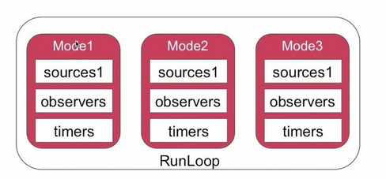

# 控件特性(API)


## NSTimer
```
// 创建一个timer并把它指定到一个默认的runloop模式中，并且在 TimeInterval时间后 启动定时器
+ (NSTimer *)scheduledTimerWithTimeInterval:(NSTimeInterval)ti target:(id)aTarget selector:(SEL)aSelector userInfo:(nullable id)userInfo repeats:(BOOL)yesOrNo;

// 默认的初始化方法，（创建定时器后，手动添加到 运行循环，并且手动触发才会启动定时器）
- (instancetype)initWithFireDate:(NSDate *)date interval:(NSTimeInterval)ti target:(id)t selector:(SEL)s userInfo:(nullable id)ui repeats:(BOOL)rep NS_DESIGNATED_INITIALIZER;

// 这是设置定时器的启动时间，常用来管理定时器的启动与停止
@property (copy) NSDate *fireDate;
      // 启动定时器
          timer.fireDate = [NSDate distantPast];    
      //停止定时器
          timer.fireDate = [NSDate distantFuture];
      // 开启
         [time setFireDate:[NSDate  distanPast]]
      // NSTimer   关闭  
        ［time  setFireDate:[NSDate  distantFunture]］
      //继续
        [timer setFireDate:[NSDate date]];

```

**NSTimer加到了RunLoop中但迟迟的不触发事件**
1. 是否添加到runloop
2. runloop是否运行
3. mode是否正确


eg:
```
- (void)viewDidLoad {
    [super viewDidLoad];
    // Do any additional setup after loading the view.

    dispatch_queue_t queue = dispatch_queue_create("com.appple.cn", DISPATCH_QUEUE_CONCURRENT);
    dispatch_async(queue, ^{
        [NSTimer scheduledTimerWithTimeInterval:1.0 target:self selector:@selector(action:) userInfo:nil repeats:YES];
    });

}

- (void)action:(NSTimer *)timer
{
    NSLog(@"action:%@", timer);
}
```
**timer和runloop关系**



* [NSTimer的使用](https://www.jianshu.com/p/3ccdda0679c1)

## 多线程的坑点
#### 1.常驻线程
```
+ (void)networkRequestThreadEntryPoint:(id)__unused object {
  @autoreleasepool {
      // 先用 NSThread 创建了一个线程
      [[NSThread currentThread] setName:@"AFNetworking"];
      // 使用 run 方法添加 runloop
      NSRunLoop *runLoop = [NSRunLoop currentRunLoop];
      [runLoop addPort:[NSMachPort port] forMode:NSDefaultRunLoopMode];
      [runLoop run];
} }
```

坑点:
> 浪费CPU资源, 降低CPU的利用率

**既然常线程是个坑，那为什么 AFNetworking 2.0 库还要这么做呢?**
由于`AFNetworking 2.0` 使用的是 `NSURLConnection`，而`NSURLConnection`发起请求后，所在的线程需要一直存活，以等待接收 `NSURLConnectionDelegate`回调方法。但是，网络 返回的时间不确定，所以这个线程就需要一直常驻在内存中.
而且主线程还要 **处理大量的UI和交互工作**, 所以得重新创建一个常住线程来满足需求;

`AFNetworking 3.0`版本时，使用苹果公司新推出的 `NSURLSession` 替换了 `NSURLConnection`，从而避免了常驻线程这个坑;

如果你需要确实需要 **保活线程一段时间** 的话，可以选择使用 `NSRunLoop` 的另外两个方法 `runUntilDate:` 和 `runMode:beforeDate`，来指定线程的保活时⻓。让线程存活时间可预期，总比让线程常驻，至少在硬件资源利用率这点上要 更加合理。
或者，你还可以使用 `CFRunLoopRef` 的 `CFRunLoopRun` 和 `CFRunLoopStop` 方法来完成 `runloop` 的开启和停止，达到将线程保活一段时间的目的。

#### 2.并发
坑点:
> 随着任务数量的增加,会导致内存资源越来越紧张

**FMDB只通过FMDatabaseQueue开启了一个线程队列，来串行地操作数据库。这，又是为什么呢?**
在进行数据读写操作时, 总是需要一段时间来等待磁盘响应的, 如果在这个时候通过 `GCD` 发起了一个任务，那么`GCD` 就会本着最大化利用 `CPU`的原则，会在这个空档，再创建一个新线程来保证能够充分利用 `CPU`。
随着任务数量的增加，`GCD` 创建的 **新线程** 就会越来越多，从而导致内存资源越来越紧张，等到磁盘开始响应后，再读取数据又会占用更多的内存。结果就是，失控的内存占用会引起更多的内存问题。

`FMDB`通过`FMDatabaseQueue` 这个核心类， 将与读写数据库相关的磁盘操作都放到 **一个串行队列** 里执行，从而避免了线程创建过多导致系统资源紧张的情况。

总结来讲，类似数据库这种需要频繁读写磁盘操作的任务，尽量使用 **串行队列** 来管理，避免因为多线程并发而出现 **内存问题**。

#### 3.内存问题
创建线程的过程，需要用到物理内存，`CPU`也会消耗时间.
* 新建一个线程，系统还需要为这个进程空间分 配一定的内存作为线程堆栈。
堆栈大小是 4KB 的倍数。在iOS 开发中，主线程堆栈大小是 1MB，新创建的子线程堆栈大小是 512KB。
* `CPU`在切换线程上下文时，还会更新 **寄存器**，更新寄存器的时候需要 **寻址**，而寻址的过程还会有较大的`CPU` 消耗。

所以，线程过多时内存和`CPU`都会有大量的消耗，从而导致`App`整体性能降低，使得用户体验变成差。CPU 和内存的使用 **超出系统限制** 时，甚至会造成 **系统强杀**。这种情况对用户和`App`的伤害就更大了。

## `NSMapTable`与`NSDictionary`/`NSMutableDictionary`对比
* 可变类型: `NSDcitionary`有一个可变类型`NSMutableDictionary`，`NSMapTable`没有可变类型，它本身就是可变的;
* 使用限制: `NSDcitionary`/`NSMutableDictionary`中对于key和value的内存管理方法唯一，即对`key`进行`copy`，对`value`进行强引用，而`NSMapTable`没有限制；
* 映射关系: `NSDcitionary`中对`key`值进行`copy`，不可改变，通常用字符串作为`key`值，只是`key->object`的映射，而`NSMapTable`的`key`是可变的对象，既可以实现`key->object`的映射，又可以实现`object->object`的映射;

```
NSMapTable *aMapTable = [[NSMapTable alloc] initWithKeyOptions:NSPointerFunctionsCopyIn valueOptions:NSPointerFunctionsStrongMemory capacity:0];
或
NSMapTable *aMapTable = [NSMapTable mapTableWithKeyOptions:NSPointerFunctionsCopyIn valueOptions:NSPointerFunctionsStrongMemory];
```
等同于
```
NSMutableDictionary *aDictionary = [[NSMutableDictionary alloc] initWithCapacity:0];
或
NSMutableDictionary *aDictionary = [NSMutableDictionary dictionary];
```

#### 1.`NSDictionary`
由于对象存储在特定位置，`NSDictionary`中要求`key`的值不能改变（否则`object`的位置会错误）。为了保证这一点，`NSDictionary`会始终复制`key`到自己私有空间。
这个`key`的复制行为也是`NSDictionary`如何工作的基础，但是这也有一个限制：你只能使用OC对象作为`NSDictionary`的`key`，并且必须支持`NSCopying`协议，我们也可以从上面的方法中看到。此外，`key`应该是 **小并且高效的**，以至于复制的时候 **不会对CPU和内存造成负担** 。

#### 2.`NSMapTable`
* 与`NSDictionary`一样，以键值对的方式存储内容；
* `key` 可以不用遵循 `NSCopying` 协议；
* `key` 和 `value` 的内存管理方式可以分开，如：`key` 是强引用，`value` 是弱引用；

* [Cocoa 集合类型：NSPointerArray，NSMapTable，NSHashTable](http://www.saitjr.com/ios/nspointerarray-nsmaptable-nshashtable.html#%E5%B0%8F%E7%BB%93)
