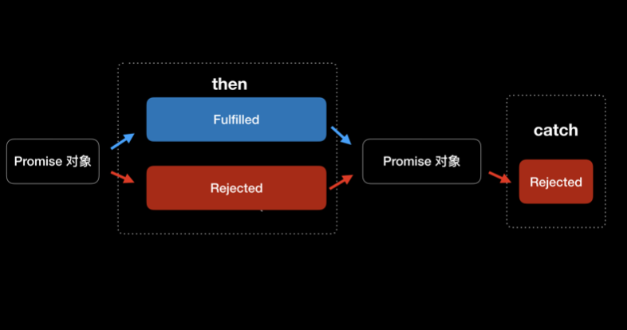
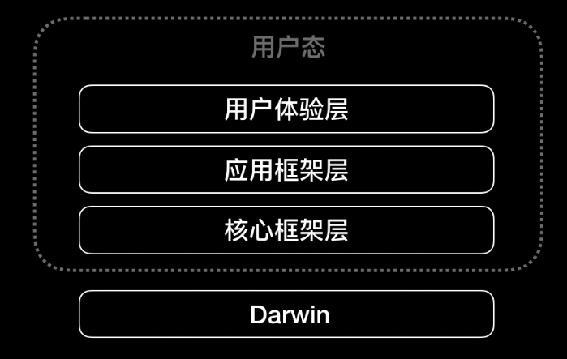
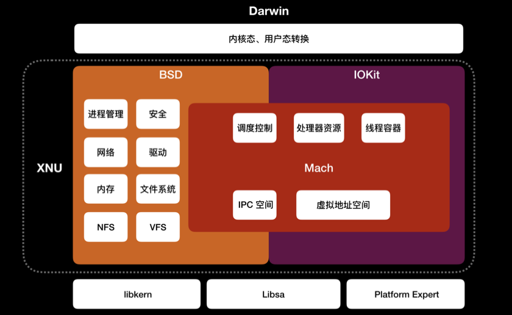
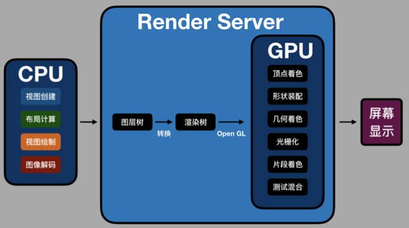

# 架构&框架&&需求
本篇打算总结架构&框架相关知识,有任何问题欢迎[issue](https://github.com/binzi56/iOSSmallKnowledgePool/issues);

### 构建底层的发布和订阅事件总线
由于 `Delegate` 和 `Block` 只适合做一对一数据传递，`KVO` 和 `NSNotificationCenter` 虽然可以支持一对多的数据传 递，但存在过于灵活而无法管控和维护的问题，而事件总线需要通过发布和订阅这种可管控方式实现一对一和一对多数据传 递。由此可以看出，iOS 现有的 `Delegate`、`Block`、`KVO`、`NSNotificationCenter` 等技术并不适合来做事件总线。

其实，响应式第三方库 `ReactiveCocoa` 和 `RxSwift` 对事件总线的支持是没有问题的，但这两个库更侧重的是响应式编程，事 件总线只是其中很小的一部分。

**`Promise`**
现在前端领域有一种模式叫作 `Promise`，这是一种专⻔针对异步数据操作编写的一套统一规则的模式。
本质上，这种模式本质是通过 `Promise` 对象**保存异步数据操作**，同时 `Promise` 对象提供统一的异步数据操作事件处理的**接 口**。这样，事件总线的数据订阅和数据发布事件，就可以通过 `Promise` 对象提供的接口实现出来，比以前通过`Delegate`回调 处理异步事件来说更加合理。

`Promise` 对象会有三种状态，分别是 `pending`、`fulfilled`、`rejected`:
* `pending` 表示 `Promise` 对象当前正在等待异步事件处理中;
* `fulfilled` 指的是 `Promise` 对象当前处理的异步事件已经成功完成;
* `rejected` 表示 `Promise` 对象当前处理的异步事件没有成功。

`Promise` 对象还有两个重要的方法，分别是 `then` 和 `catch`。`Promise` 对象每次执行完 `then` 和 `catch` 方法后，这两个方法会返回先前的 `Promise` 对象，同时根据异步操作结果改变`Promise` 对象的状态。



有了 `Promise` 对象后，整个异步发布和订阅操作都以同步操作的方式表现出来了。`Promise` 对象不仅能够避免回调层层嵌套，而且通过 `Promise`的统一接口，使得事件总线的发布和订阅操作更加规范和易用。

**`PromiseKit`**
我们先来看看如何使用 `Promise` 对象的 `then` 和 `catch` 方法。
1. 假设有这么一个需求:
2. 首先，通过一个异步请求获取当前用户信息; 然后，根据获取到的用户信息里的用户编号再去异步请求获取用户的时间轴列表;
3. 最后，将用户的时间轴列表数据，赋值给当前类的时间轴列表属性。

```
firstly {
	// 异步获取当前用户信息
	fetchUserInfo()
}.then { userInfo in
	// 使用异步获取到的用户信息中的 uid 再去异步获取用户的 timeline
	fetchUserTimeline(uid: userInfo.uid)
}.then { timeline in
	// 记录 timeline
    self.timeline = timeline
}.catch {
    // 整个方法链的错误都会在这处理
}
```
可以看出，多次异步请求通过 `Promise` 的方法调用，看起来就像进行同步操作一样，顺序和逻辑也更加清晰了。使用 `then` 方 法可以让异步操作一个接着一个地按顺序进行。如果异步操作 `fetchUserInfo` 失败，会返回一个状态是 `rejected` 的 `Promise` 对 象，返回的这个 `Promise`对象会跳过后面所有的`then` 方法直接执行 `catch` 方法。这就和事件总线中发布事件触发后，**订阅事件会一个接一个执行是一样的**。

除了 `then` 和 `catch` 方法以外，`PromiseKit` 还有一些好用的方法。
* 比如 `always`方法。使用了 `always` 方法以后， `Promise` 对象每次在执行方法时，都会执行一次 `always` 方法。
* 再比如`when` 方法。这个方法的使用场景就是，指定多个异步操作，等这些操作都执行完成后就会执行 `when` 方法。`when`方法类似 `GCD` 里面的 `Dispatch Group`，虽然实现的功能一样，但是代码简单了很多，使用起来也更加方便。

`PromiseKit` 还为苹果的 `API` 提供了扩展。这些扩展需要单独集成，你可以在[PromiseKit 组织⻚面](https://github.com/PromiseKit)获取。目前大部分常用的`API`
都有扩展，比如 `UIKit`、`Foundation`、`CoreLocation`、`QuartzCore`、`CloudKit` 等等，甚至还支持了第三方的框架 `Alamofire`。

### Flexbox布局比自动布局好在哪里
 `React Native`、`Weex` 和 `Texture`(`AsyncDisplayKit`) 这些知名布局库采用的就是`Flexbox`布局思路。不可小觑的是，苹果公司官方的`UIStackView`，也是采用`Flexbox`思路来实现布局的。

 目前来看，`iOS` 系统提供的布局方式有两种:
 * `Frame`
 * `Auto Layout`

 通过 [Masonry](https://github.com/SnapKit/Masonry)和 [SnapKit](https://github.com/SnapKit/SnapKit)这些第三方库，自动布局的易用性也有了很大提升。而且`iOS 12` 以后，苹果公司也已经解决了自动布局在性能方面的问题;

**我们为什么还要关注其他布局思路呢?**

 **其一**，自动布局思路本身还可以再提高。`Flexbox` 比自动布局提供了更多、更规范的布局方法，布局方式考虑得更全面，使用
 起来也更加方便。同时，苹果公司基于 `Flexbox` 的布局思路，又在自动布局之上封装了一层 `UIStackView`。
 **其二**，针对多个平台的库需要使用更加通用的布局思想。`Flexbox` 在`2009`年被 `W3C` 提出，可以很简单、完整地实现各种⻚面布局，而且还是响应式的，开始被应用于前端领域，目前所有浏览器都已支持。后来通过 `React Native` 和 `Weex` 等框架，它被带入到客户端开发中，同时支持了 `iOS` 和 `Android`。

 * [Flex 布局教程:语法篇](http://www.ruanyifeng.com/blog/2015/07/flex-grammar.html)

 **Texture 如何使用 Flexbox 思路进行布局?**
 `Texture`框架的布局中，`Texture`考虑到布局扩展性，提供了一个基类 `ASLayoutSpec`。这个基类提供了布局的基本能力，使 `Texture` 可以通过它扩展实现多种布局思路，比如 `Wrapper`、`Inset`、`Overlay`、`Ratio`、`Relative`、`Absolute` 等布局思路，也可以继承 `ASLayoutSpec` 来自定义你的布局算法。
`ASLayoutSpec`的子类，及其具体的功能如下:
```
ASAbsoluteLayoutSpec // 绝对布局
ASBackgroundLayoutSpec // 背景布局
ASInsetLayoutSpec // 边距布局
ASOverlayLayoutSpec // 覆盖布局
ASRatioLayoutSpec // 比例布局
ASRelativeLayoutSpec // 顶点布局
ASCenterLayoutSpec // 居中布局
ASStackLayoutSpec // 盒子布局
ASWrapperLayoutSpec // 填充布局
ASCornerLayoutSpec // ⻆标布局
```
接下来，我们一起看看`ASLayoutSpec`的子类中，应用最广泛的`ASStackLayoutSpec`。它和 iOS 中自带的 `UIStackView` 类 似，布局思路参照了 `Flexbox`，比如 `horizontalAlignment`、`alignItems`、`flexWrap` 等属性很容易和 `Flexbox` 对应上。
下面示例是一段官方的 `ASStackLayoutSpec` 示例代码。`ASStackLayoutSpec` 布局思路和 `Flexbox`是一样的，所以我们通过示 例可以了解，如何通过 `Texture` 使用 `Flexbox` 布局思路开发界面:
```
- (ASLayoutSpec *)layoutSpecThatFits:(ASSizeRange)constraint {
		// 创建一个纵轴方向的 ASStackLayoutSpec 视图容器 vStack ASStackLayoutSpec *vStack = [[ASStackLayoutSpec alloc] init]; // 设置两个子节点，第一个节点是标题，第二个正文内容
		[vStack setChildren:@[titleNode, bodyNode];
		// 创建一个横轴方向的 ASStackLayoutSpec 视图容器 hstack
		ASStackLayoutSpec *hstack = [[ASStackLayoutSpec alloc] init];
		hStack.direction = ASStackLayoutDirectionHorizontal;
		hStack.spacing = 5.0; // 设置节点间距为5

		// 在 hStack 里添加 imageNode 和 vStack 节点
		[hStack setChildren:@[imageNode, vStack]];

		// 创建一个 ASInsetLayoutSpec 容器，设置四周边距为5，将 hStack 作为其子节点
		ASInsetLayoutSpec *insetSpec = [ASInsetLayoutSpec insetLayoutSpecWithInsets:UIEdgeInsetsMake(5, 5, 5, 5) child:headerStackSpec];
    return insetSpec;
}
```
上面的视图效果如下:

除了 `Texture` 用到了 `Flexbox` 的布局思路，`React Native` 和 `Weex` 也用到了这个布局思路。这两个框架对 `Flexbox` 算法的实 现，是一个叫作[Yoga](https://github.com/facebook/yoga) 的 C++ 库。
除了 `React Native` 和 `Weex` 之外，`Yoga` 还为很多其他开源框架提供支持，比如 [Litho](https://fblitho.com/)、[ComponentKit](https://componentkit.org/) 等。 为了能够用于各个平台，`Yoga`是由 `C/C++`` 语言编写的，依赖少，编译后的二进制文件也小，可以被方便地集成到 `Android` 和`iOS` 上。

随着新硬件的不断推出，比如手表和折叠屏手机，你可能还需要掌握更多的布局算法，以不变应万变。比如说，除了 `Flexbox` 思路的布局 `ASStackLayoutSpec`以外，`Texture`中还有 `Wrapper`、`Inset`、`Overlay`、`Ratio`、`Relative`、`Absolute` 等针对不同场景的布局思路，同时还支持自定义布局算法。

**Flexbox 算法**
`Flexbox` 算法的主要思想是，让 `flex`容器能够改变其`flex`项目的宽高和顺序，以填充可用空间，`flex`容器可以通过扩大项目来填
充可用空间，或者缩小项目以防止其超出其可用空间。

**首先**，创建一组匿名的 `flex` 项目，按照这组匿名 `flex`项目设置的排列规则对其进行排列。
* 第一步，确定 `flex`项目的 `main space` 和 `cross space`，如果 `flex`容器定义了大小就直接使用定义的大小;否则， 从 `flex`容器的可用空间里减去 `margin`、`border`、`padding`。
* 第二步，确定每个项目的 `flex base` 大小和假设的大小，其中假设的大小是项目依据它最小和最大的大小属性来确定的。 `flex` 容器的大小，由它的大小属性来确定。

**接着**，将 `flex`项目收集到 `flex lines` 中。

**最后**，进行 `Main-Axis` 对⻬和 `Cross-Axis` 对⻬。

* `Main-Axis` 对⻬就是分配剩余空间。对于每个 `flex line`，如果有剩余空间， `margin` 设置为 `auto` 的话，就平均分配剩余空间。
* `Cross-Axis` 对⻬，先要解决自动 `margin`，然后沿 `cross-axis` 对⻬所有 `flex items`;随后确定 `flex container` 使用的 `cross` 大小;最后对⻬所有 `flex lines`。

`flexbox` 的算法简而言之就是:首先依据 `View` 的 `margin`、`padding`、`border` 确定出横纵大小，接下来确定排列，根据 `View` 的大小确定 `Subviews` 的行内容，确定出行中每个 `Subview` 的大小，最终确定出 `Subview` 的位置。

### 怎么应对各种富文本表现需求?
**一个 Web ⻚面预加载库 [STMURLCache](https://github.com/ming1016/GCDFetchFeed/blob/master/GCDFetchFeed/GCDFetchFeed/STMURLCache.m)来预缓存 HTML 里的图片**

在⻓列表这种场景下，如果不用 `HTML` 来描述富文本的话，想要使用原生 `iOS` 代码来描述富文本的话，你还可以使用苹果官方的`TextKit`和`YYText`来展示。

其中，`YYText` 不仅兼容 `UILabel` 和 `UITextView`，在异步文字布局和渲染上的性能也非常好。

**YYText**
`YYText` 对于富文本的图文混排使用的是自定义的 `NSMutableAttributedString` 分类，自定义分类不光简化了 `NSMutableAttributedString`，还增加了功能，除了图片外，可以嵌入 `UIView` 和 `CALayer`。

`UIWebView` 展示的是使用 `HTML` 描述的富文本。`HTML` 是描述富文本最简单和最常用的方式，相对于 `YYText` 或 `TextKit` 那样 描述富文本的方式来说，更加简洁和标准。不过，UIWebView 的缺点也比较明显，同时创建多个 `UIWebView` 实例，对于内存的占用会非常大。
所以，如果是列表展示富文本建议使用 `TextKit` 或者 `YYText`，其他情况可以选择使用 `UIWebView` 来展示富文本。
`WKWebView` 思路类似，使用`WKURLSchemeHandler`就行.

### 代码规范
统一的编码规范，能有限的避免团队成员由于代码风格不一致而导致的相互认同感缺失的问题。

好的代码规范，需要从如下八个方面进行约束：常量、变量、属性、条件语句、循环语句、函数、类、分类;
#### 常量
在常量的使用上，建议尽量使用类型常量，而不是宏定义。比如定义一个字符串常量，可以写成：
```
static NSString * const kStringName = @"kStringName";
```
#### 变量
对于变量来说，我认为好的编码习惯是：
* 变量名应该可以明确体现出功能，最好再加上类型做后缀。这样也就明确了每个变量都是做什么的，而不是把一个变量当作不同的值用在不同的地方。
* 在使用之前，需要先对变量做初始化，并且初始化的地方离使用它的地方越近越好。
* 不要滥用全局变量，尽量少用它来传递值，通过参数传值可以减少功能模块间的耦合。

#### 属性
`Objective-C` 里的属性，要尽量通过 `get` 方法来进行懒加载，以避免无用的内存占用和多余的计算。
`Swift` 的计算属性如果是只读，可以省掉 `get` 子句，实例代码如下：
```
var areaDouble : Double {
    return long * width
}
```
#### 条件语句
在条件语句中，需要考虑到条件语句中可能涉及到的所有分支条件，对于每个分支条件都需要考虑到，并进行处理，减少或不使用默认处理。特别是 `Switch` 处理枚举时，不要有 `default` 分支。

另外，条件语句的嵌套分支不宜过多，可以充分利用 `Swift` 中的 `guard` 语法
例如这段实例代码
```
if let userName = login.userNameOK {
    if let password = login.passwordOK {
        // 登录处理
        ...
    } else {
        fatalError("login wrong")
    }
} else {
    fatalError("login wrong")
}
```
上面这段代码表示的是，当用户名和密码都没有问题时再进行登录处理，那么我们可以使用 `guard` 语法
```
guard
    let userName = login.userNameOK,
    let password = login.passwordOK,
else {
    fatalError("login wrong")
}
// 登录处理
...
```
#### 循环语句
在循环语句中，我们应该尽量少地使用 `continue` 和 `break`，同样可以使用 `guard` 语法来解决这个问题。解决方法是：所有需要 `continue` 和 `break` 的地方统一使用 `guard` 语法去处理，将所有的异常放到一处。这样的好处是在维护的时候方便阅读，使得代码更加易读和易于理解。

#### 函数
对于函数来说，体积不宜过大，最好控制在百行代码以内。如果函数内部逻辑过多，我们可以将复杂逻辑分解成多个小逻辑。并将每个小逻辑提取出来作为一个单独的函数，每个函数处理最小单位的逻辑，然后一层一层往上组合。
这样我们可以通过函数名明确那段逻辑处理的目的，提高代码的可读性。
拆分成多个逻辑简单的函数之后，我们需要对函数的入参进行验证，同样 `guard` 语法同样适用于检查入参。
```
func saveRSS(rss: RSS?, store: Store?) {
    guard let rss = rss else {
        return
    }
    guard let store = store else {
        return
    }

    // 保存 RSS
    return
}
```
另外，函数内部尽量避免使用全局变量来传递数据，使用参数或者局部变量传递数据能够减少函数对外部的依赖，减少耦合，提高函数的独立性，提高单元测试的准确性。

#### 类
在 `Objective-C` 中，类的头文件应该尽可能少的引入其他类的头文件，可以通过 `class` 关键字进行声明，然后在实现文件里引入需要的其他类的头文件。
对于继承和遵循协议的情况，无法避免移入其他类的头文件，所以在代码设计时还是要尽量减少继承，特别是继承关系太多时不利于代码的维护和修改，比如说修改父类时还需要考虑对所有子类的影响，如果评估不全，影响就难以控制.

#### 分类
在写分类时，分类里增加的方法名要尽量加上前缀，而如果是系统自带类的分类的话，方法名就一定要加上前缀，来避免方法名重复的问题。
分类适合多人负责同一个类时，根据不同分类来进行各自不同功能代码的维护。

**Code Review**

* swift: [SwiftLint](https://github.com/realm/SwiftLint)
* OC:    [OCLint](http://oclint.org/)


* [使用 OCLint 自定义 MVVM 规则](http://yulingtianxia.com/blog/2019/01/27/MVVM-Rules-for-OCLint/)

### iOS系统内核XNU
#### iOS 系统架构
`iOS` 系统是基于 `ARM` 架构的，大致可以分为四层:
* 最上层是用户体验层，主要是提供用户界面。这一层包含了 `SpringBoard`、`Spotlight`、`Accessibility`。
* 第二层是应用框架层，是开发者会用到的。这一层包含了开发框架 `Cocoa Touch`。
* 第三层是核心框架层，是系统核心功能的框架层。这一层包含了各种图形和媒体核心框架、`Metal` 等。
* 第四层是 `Darwin`层，是操作系统的核心，属于操作系统的内核态。这一层包含了系统内核 `XNU`、驱动等。



#### XNU
`XNU` 内部由 `Mach`、`BSD`、驱动 `API` `IOKit` 组成，这些都依赖于 `libkern`、`libsa`、`Platform Expert`。如下图所示:



`XNU` 采用的是微内核 `Mach` 和 宏内核 `BSD` 的混合内核，具备微内核和宏内核的优点。
* 微内核可以提高系统的模块化程度，提供内存保护的消息传递机制;
* 宏内核也可以叫单内核，在出现高负荷状态时依然能够让系统保持高效运作。

`Mach` 是微内核，可以将操作系统的核心独立在进程上运行，不过，内核层和用户态各层之间切换上下文和进程间消息传递都 会降低性能。为了提高性能，苹果深度定制了 `BSD` 宏内核，使其和 `Mach` 混合使用。
宏内核 `BSD` 是对 `Mach` 封装，提供进程管理、安全、网络、驱动、内存、文件系统(`HFS+`)、网络文件系统(`NFS`)、虚 拟文件系统(`VFS`)、`POSIX`(`Portable Operating System Interface of UNIX`，可移植操作系统接口)兼容。
除了微内核 `Mach` 和宏内核 `BSD` 外，`XNU` 还有 `IOKit`。`IOKit` 是硬件驱动程序的运行环境，包含电源、内存、`CPU`等信息。 `IOKit` 底层 `libkern` 使用 `C++`` 子集 `Embedded C++` 编写了驱动程序基类，比如 `OSObject`、`OSArray`、`OSString`等，新驱动可 以继承这些基类来写。

#### XNU 怎么加载 App?
`iOS` 的可执行文件和动态库都是 `Mach-O` 格式，所以加载 `APP` 实际上就是加载 `Mach-O` 文件。
`Mach-O header` 信息结构代码如下:

```
struct mach_header_64 {
    uint32_t    magic;      /* 64位还是32位 */
    cpu_type_t  cputype;    /* CPU 类型，比如 arm 或 X86 */
    cpu_subtype_t   cpusubtype; /* CPU 子类型，比如 armv8 */
    uint32_t    filetype;   /* 文件类型 */
    uint32_t    ncmds;      /* load commands 数量*/
    uint32_t    sizeofcmds; /* load commands 大小*/
    uint32_t    flags;      /* 标签 */
    uint32_t    reserved;   /* 保留字段 */
};

```

其中，文件类型 `filetype` 表示了当前 `Mach-O` 属于哪种类型。`Mach-O` 包括以下几种类型。
* `OBJECT`，指的是 .o 文件或者 .a 文件;
* `EXECUTE`，指的是`IPA` 拆包后的文件;
* `DYLIB`，指的是 .dylib 或 .framework 文件;
* `DYLINKER`，指的是动态链接器;
* `DSYM`，指的是保存有符号信息用于分析闪退信息的文件。

加载 `Mach-O` 文件，内核会 `fork` 进程，并对进程进行一些基本设置，比如为进程分配虚拟内存、为进程创建主线程、代码签
名等。用户态 `dyld` 会对 `Mach-O` 文件做库加载和符号解析。

整个fork过程可以在[源码](https://github.com/apple/darwin-xnu/blob/master/bsd/kern/kern_exec.c)中查看;

总体来说，`XNU` 加载就是为 `Mach-O` 创建一个新进程，建立虚拟内存空间，解析`Mach-O`文件，最后映射到内存空间。流程可以概括为:
1. fork 新进程;
2. 为 Mach-O 分配内存;
3. 解析 Mach-O;
4. 读取 Mach-O 头信息;
5. 遍历 load command 信息，将 Mach-O 映射到内存;
6. 启动 dyld。

### ReactNative、Flutter等跨端方案的选择
目前，主流的跨端方案， 主要分为两种:一种是将 `JavaScriptCore` 引擎当作虚拟机的方案，代表框架是 `React Native`, `Weex`;另一种是，使用非 `JavaScriptCore` 虚拟机的方案，代表框架是 `Flutter`。

#### React Native框架的优势
`React Native` 使用 `JavaScript` 语言来开发，`Flutter` 使用的是`Dart` 语言。
* 从编程语言的⻆度来看, 虽然 `Dart` 语言入⻔简单，但从⻓远考虑，还是选择`React Native` 会更好一些。因为`JavaScript` 的历史和流行程度都远超 `Dart` ，生态也更加完善。
* 从⻚面框架和自动化工具的⻆度来看, `React Native`工具链非常完善，这主要得益于 `Web` 技术这么多年的积累。

#### Flutter框架的优势
`Flutter`的优势最主要体现在**性能、开发效率和体验**。
1. 性能
* 最核心的虚拟机
   * `React Native`使用的`JavaScriptCore`为了兼容 Web 标准留下的历史包袱，无法专⻔针对移动端进行性能优化。
   * `Flutter`使用全新的 `Dart` 语言编写，同时支持 `AOT` 和 `JIT`两种编译方式，而没有采用 `HTML/CSS/JavaScript` 组合方式开发，在执行效率上明显高于 `JavaScriptCore` 。
* UI框架的实现
   * `Flutter`重写了`UI` 框架，从 `UI` 控件到渲染，全部重新实现了，依赖 `Skia` 图形库和系统图形绘制相关的接口，保证了不同平台上能有相同的体验。
   * `React Native`的一大特点就是用户界面其实都是由原生组件所组成。`JavaScript`编写的`React`组件仅仅作为原生视图的抽象表现以及配置。**所有`React`组件最后都会被渲染成原生`UI`组件**。

2. 开发效率和体验
* 凭借**热重载**(`Hot Reload`)这种极速调试技术，极大地提升了开发效率;
* `Flutter`因为重新实现了`UI`框架，可以不依赖 `iOS` 和 `Android` 平台的原生控件，所以无需专⻔去处理平台差异，在开发体验上实现了真正的统一。
* 学习资源也非常丰富;

或许，你还会说`Flutter` 包大小是个问题。`Flutter`的渲染引擎是自研的，并没有用到系统的渲染，所以`App`包必然会大些。但是，我觉得从⻓远来看，`App Store`对包大小的限制只会越来越小，所以说这个问题一定不会成为卡点。

3. `Flutter`对动态化能力的支持
优先级:
软件架构 => 动态化

---

// 谷歌移动端的新系统
在 `Fuchsia` 技术的选择上，谷歌选择了**微内核**、优于 `OpenGL` **高内核 低开销**的图像接口 `Vulkan`、`3D` 桌面渲染 `Scenic`、`Flutter` 开发框架。
`Fuchsia` 架构分为四层，包括
* 微内核的第一层 `Zircon`
* 提供系统服务的第二层 `Garnet`
* 用户体验基础设施的第三层 `Peridot`
* 基础应用的第四层 `Topaz`(`Flutter`所在层)。

结合 `Android` 系统的经验，在设计架构之初，谷歌就考虑了厂商对深度定制的诉求，使得每层都可以进行替换，模块化做得比 `Android`系统更加彻底。

---

**Flutter的布局和渲染**
* [The Mahogany Staircase - Flutter’s Layered Design](https://www.youtube.com/watch?v=dkyY9WCGMi0)
* [Flutter’s Rendering Pipeline](https://www.youtube.com/watch?v=UUfXWzp0-DU&t=1955s)


### 原生布局转到前端布局，开发思路的转变
`Auto Layout` 的布局思路还处在处理两个视图之间关系的初级阶段，而前端的 `Flexbox` 已经进化到处理一组堆栈视图关系的地步;

`Auto Layout` => `VFL`(`Visual Format Language`，可视化格式语言) => `UIStackView` => `SwiftUI`

#### UIStackView
和 `Flexbox` 一样，按照`UIStackView`设置的规则，一组堆栈视图在可用空间中进行动态适应。这组视图按照堆栈中的顺序，沿着轴的方向排列。这里的轴，可以设置为横轴或纵轴。所以，`UIStackView` 和 `Flexbox`布局框架一样，布局都取决于这组堆栈视图设置的各个属性，比如轴方向、对⻬方式、间距等等。虽然在布局思路上，做到了和`Flexbox`对⻬，但写法上还是不够直观。

#### SwiftUI
`SwiftUI`在写法上非常简洁，可读性也很强。
除了支持简洁的链式调用外，它还通过 `DSL` 定制了 `UIStackView` 的语法。这套 `DSL` 的实现，使用的是 `Function Builders` 技
术，可以让 `DSL` 得到编译器的支持;

至此，原生布局的开发思路从布局思路优化转向了 `DSL`。 `DSL` 编写后的处理方式分为两种:
* 一种是，通过解析将其转化成语言本来的面目，`SwiftUI` 使用的就是这种方式;
* 另一种是，在运行时解释执行 `DSL`。`SQL` 就是在运行时解释执行的 `DSL`。

1. 解析转换 DSL
* [HTML 转原生 HTN 项目开发记录](https://ming1016.github.io/2017/10/16/html-to-native-htn-development-record/)
* [Swift DSL 编写 HTML 的项目Vaux](https://github.com/dokun1/Vaux)
2. 运行时解释执行 DSL
* [STMAssembleView](https://github.com/ming1016/STMAssembleView)

---
小结:

技术演进节奏的把握和对产品一样，都是**一步一步递进**。也就是说，新技术都依赖于上一个技术，只有上一个技术 完善后才会推出新的技术，而不是一次快速打包推出后再依赖后期完善。

1. 优先解决 `Auto Layout`处理视图关系繁琐的问题,推出了`UIStackView`;
  * 语言写法不够简洁、编译器没有突破
2. 推出语法更加简洁的 `Swift` 语言和支持 `Hot Reload`(热重载)的 `Playground`;
3. 通过一种能和编译器相结合的编程语言特性 `Function Builders`,不仅支持了现在的界面开发 `DSL`，也具备了结合其他领域 `DSL` 的能力;

---

附:
* [读 SnapKit 和 Masonry 自动布局 框架源码](https://ming1016.github.io/2018/04/07/read-snapkit-and-masonry-source-code/)
* [About-SwiftUI](https://github.com/Juanpe/About-SwiftUI)
* [SwiftUI 的 DSL 语法分析](https://zhuanlan.zhihu.com/p/68294674)

### iOS原生、大前端和Flutter分别是怎么渲染的
#### 渲染原理
我们看到的 `App` 界面，都是由 `CPU` 和 `GPU` 共同计算处理的。
* `CPU` 内部流水线结构拥有并行计算能力，一般用于**显示内容的计算**。
* 而 `GPU`的并行计算能力更强，能够通过**渲染**将内存中的图形数据，经过转换显示到屏幕上。

在渲染过程中:
* `CPU` 专⻔用来处理渲染内容的计算，比如视图创建、布局、图片解码等。
* 内容计算完成后，再传输给 `GPU` 进行渲染。

图形渲染:
`VGA`(`Video Graphics Array`，视频图形阵列) ==(`3D`加速的需要)==> `GPU`

`GPU`的主要工作:
将 `3D` 坐标转化成 `2D` 坐标，然后再把`2D` 坐标转成实际像素;
具体实现可以分为六个阶段:
1. 顶点着色器(确定形状的点)
2. 形状装配(确定形状的线)
3. 几何着色器(确定三⻆形个数)
4. 光栅化(确定屏幕像素点)
5. 片段着色器(对像素点着色)
6. 测试与混合(检查深度和透明度进行混合)

为了能够更方便地控制 `GPU` 的运算，`GPU` 的可编程能力也不断加强，开始支持 `C` 和 `C++` 语言。通过 `OpenGL` 标准定义的库，可以更容易地操作 `GPU`。

#### 原生渲染
原生界面更新渲染的流程，可以分为以下四步。
* 第一步，更新视图树，同步更新图层树。
* 第二步，`CPU` 计算要显示的内容，包括视图创建(设置 `Layer` 的属性)、布局计算、视图绘制(创建 `Layer` 的 `Backing Image`)、图像解码转换。当 `runloop` 在 `BeforeWaiting` 和 `Exit` 时，会通知注册的监听，然后对图层打包，打完包后，将打包数据发送给一个独立负责渲染的进程 `Render Server`。
* 第三步，数据到达 `Render Server`后会被反序列化，得到图层树，按照图层树中图层顺序、`RGBA`值、图层 `frame` 过滤图层中被遮挡的部分，过滤后将图层树转成渲染树，渲染树的信息会转给 `OpenGL ES/Metal`。前面 `CPU` 所处理的这些事情统称为 `Commit Transaction`。
* 第四步，`Render Server` 会调用 `GPU`，`GPU` 开始进行前面提到的顶点着色器、形状装配、几何着色器、光栅化、片段着色器、测试与混合六个阶段。完成这六个阶段的工作后，再将 `CPU` 和 `GPU` 计算后的数据显示在屏幕的每个像素点上。

整个渲染过程，如下图所示:



`API`内部调用逻辑:
* 渲染过程中 `Commit Trasaction` 的布局计算会重载视图 `LayoutSubviews` 方法;
* 执行 `addSubview` 方法来添加视图。视图绘制会重载视图的 `drawRect` 方法。
* 移动视图位置、删除视图、隐藏或显示视图、调用 `setNeedsDisplay` 或 `setNeedsDisplayInRect` 方法，都会触发界面更新，执行渲染流程。

#### 大前端渲染
大前端的开发框架主要分为两类:第一类是基于 `WebView` 的，第二类是类似 `React Native`。
* 对于第一类 `WebView` 的大前端渲染，主要工作在 `WebKit` 中完成。`WebKit` 的渲染层来自以前 `macOS` 的 `Layer Rendering` 架
构，而`iOS` 也是基于这一套架构。所以，从本质上来看，`WebKit` 和 `iOS` 原生渲染差别不大。
* 第二类的类`React Native` 更简单，渲染直接走的是`iOS` 原生的渲染。

**为什么会感觉 WebView 和类React Native 比原生渲染得慢呢?**
1. 从**第一次内容加载**来看，即使是本地加载，大前端也要比原生多出脚本代码解析的工作。
   * `WebView`需要额外解析 `HTML` + `CSS` + `JavaScript` 代码;
   * 而类 `React Native`方案则需要解析`JSON` + `JavaScript`;
`HTML` + `CSS` 的复杂度要高于 `JSON`，所以解析起来会比 `JSON` 慢。也就是说，首次内容加载时， `WebView` 会比类`React Native` 慢。

2. 从**语言本身的解释执行性能**来看，大前端加载后的界面更新会通过 `JavaScript` 解释执行，而`JavaScript` 解释执行性能要比原生差，特别是解释执行复杂逻辑或大量计算时。所以，大前端的运算速度，要比原生慢不少。

3. 从**语言渲染进程**来看, `WebView` 的渲染进程是单独的，每帧的更新都要通过 `IPC` 调用 `GPU` 进程。频繁的`IPC` 进程通信也会有性能损耗。`WebView`的单独渲染进程还无法访问 `GPU` 的 `context`，这样两个进程就没有办法**共享纹理资源**。纹理资源无法直接使用 `GPU` 的 `Context` 光栅化，那就只能通过 `IPC` 传给 `GPU` 进程，这也就导致 `GPU` 无法发挥自身的性能优势。由于 `WebView` 的光栅化无法及时同步到 `GPU`，滑动时容易出现白屏，就很难避免了。

#### Flutter 渲染
`Flutter` 界面是由 `Widget` 组成的，所有 `Widget` 组成 `Widget Tree`，界面更新时会更新 `Widget Tree`，然后再更新 `Element
Tree`，最后更新 `RenderObject Tree`。

**渲染流程**
`Flutter` 渲染在 `Framework` 层会有 `Build`、`Wiget Tree`、`Element Tree`、`RenderObject Tree`、`Layout`、 `Paint`、`Composited Layer` 等几个阶段。将 `Layer` 进行组合，生成纹理，使用 `OpenGL` 的接口向 `GPU` 提交渲染内容进行光栅化与合成，是在 `Flutter` 的 `C++` 层，使用的是 `Skia` 库。包括提交到 `GPU` 进程后，合成计算，显示屏幕的过程和 `iOS` 原生基本是类似的，因此性能也差不多。

### 剖析使App具有动态化和热更新能力的方案
