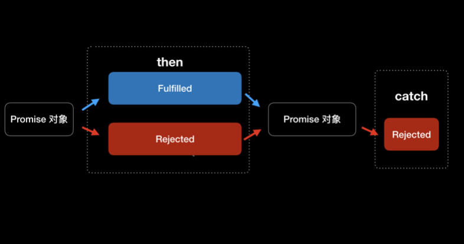

# 架构&框架
本篇打算总结架构&框架相关知识,有任何问题欢迎[issue](https://github.com/binzi56/iOSSmallKnowledgePool/issues);

### 构建底层的发布和订阅事件总线
由于 `Delegate` 和 `Block` 只适合做一对一数据传递，`KVO` 和 `NSNotificationCenter` 虽然可以支持一对多的数据传 递，但存在过于灵活而无法管控和维护的问题，而事件总线需要通过发布和订阅这种可管控方式实现一对一和一对多数据传 递。由此可以看出，iOS 现有的 `Delegate`、`Block`、`KVO`、`NSNotificationCenter` 等技术并不适合来做事件总线。

其实，响应式第三方库 `ReactiveCocoa` 和 `RxSwift` 对事件总线的支持是没有问题的，但这两个库更侧重的是响应式编程，事 件总线只是其中很小的一部分。

**`Promise`**
现在前端领域有一种模式叫作 `Promise`，这是一种专⻔针对异步数据操作编写的一套统一规则的模式。
本质上，这种模式本质是通过 `Promise` 对象**保存异步数据操作**，同时 `Promise` 对象提供统一的异步数据操作事件处理的**接 口**。这样，事件总线的数据订阅和数据发布事件，就可以通过 `Promise` 对象提供的接口实现出来，比以前通过`Delegate`回调 处理异步事件来说更加合理。

`Promise` 对象会有三种状态，分别是 `pending`、`fulfilled`、`rejected`:
* `pending` 表示 `Promise` 对象当前正在等待异步事件处理中; 
* `fulfilled` 指的是 `Promise` 对象当前处理的异步事件已经成功完成; 
* `rejected` 表示 `Promise` 对象当前处理的异步事件没有成功。

`Promise` 对象还有两个重要的方法，分别是 `then` 和 `catch`。`Promise` 对象每次执行完 `then` 和 `catch` 方法后，这两个方法会返回先前的 `Promise` 对象，同时根据异步操作结果改变`Promise` 对象的状态。



有了 `Promise` 对象后，整个异步发布和订阅操作都以同步操作的方式表现出来了。`Promise` 对象不仅能够避免回调层层嵌套，而且通过 `Promise`的统一接口，使得事件总线的发布和订阅操作更加规范和易用。

**`PromiseKit`**
我们先来看看如何使用 `Promise` 对象的 `then` 和 `catch` 方法。
1. 假设有这么一个需求:
2. 首先，通过一个异步请求获取当前用户信息; 然后，根据获取到的用户信息里的用户编号再去异步请求获取用户的时间轴列表; 
3. 最后，将用户的时间轴列表数据，赋值给当前类的时间轴列表属性。

```
firstly {
	// 异步获取当前用户信息 
	fetchUserInfo()
}.then { userInfo in
	// 使用异步获取到的用户信息中的 uid 再去异步获取用户的 timeline 
	fetchUserTimeline(uid: userInfo.uid)
}.then { timeline in 
	// 记录 timeline
    self.timeline = timeline 
}.catch {
    // 整个方法链的错误都会在这处理 
}
```
可以看出，多次异步请求通过 `Promise` 的方法调用，看起来就像进行同步操作一样，顺序和逻辑也更加清晰了。使用 `then` 方 法可以让异步操作一个接着一个地按顺序进行。如果异步操作 `fetchUserInfo` 失败，会返回一个状态是 `rejected` 的 `Promise` 对 象，返回的这个 `Promise`对象会跳过后面所有的`then` 方法直接执行 `catch` 方法。这就和事件总线中发布事件触发后，**订阅事 件会一个接一个执行是一样的**。

除了 `then` 和 `catch` 方法以外，`PromiseKit` 还有一些好用的方法。
* 比如 `always`方法。使用了 `always` 方法以后， `Promise` 对象每次在执行方法时，都会执行一次 `always` 方法。
* 再比如`when` 方法。这个方法的使用场景就是，指定多个异步操作，等这些操作都执行完成后就会执行 `when` 方法。`when`方法类似 `GCD` 里面的 `Dispatch Group`，虽然实现的功能一样，但是代码简单了很多，使用起来也更加方便。

`PromiseKit` 还为苹果的 `API` 提供了扩展。这些扩展需要单独集成，你可以在[PromiseKit 组织⻚面](https://github.com/PromiseKit)获取。目前大部分常用的`API`
都有扩展，比如 `UIKit`、`Foundation`、`CoreLocation`、`QuartzCore`、`CloudKit` 等等，甚至还支持了第三方的框架 `Alamofire`。

