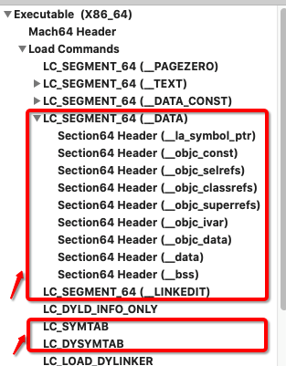
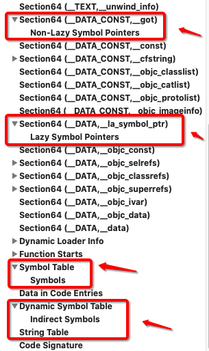
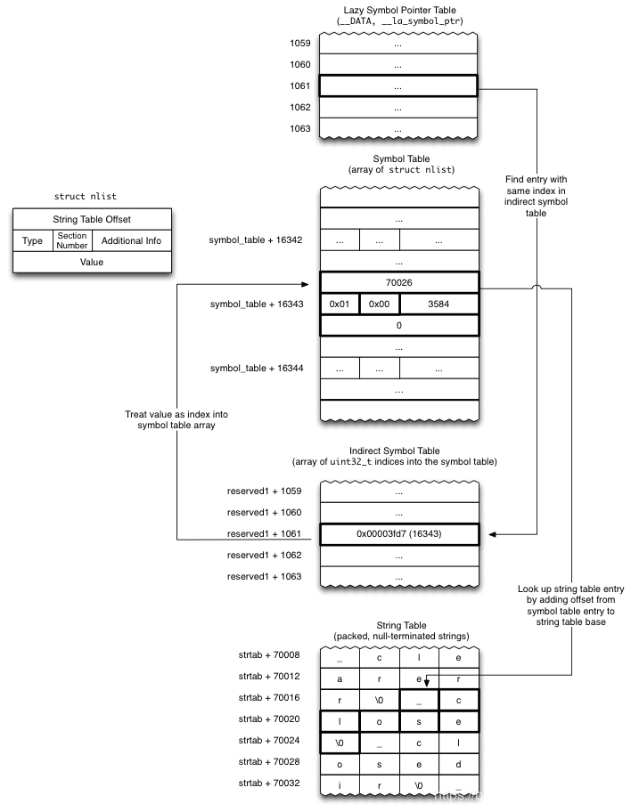

# 源码解析
本篇打算介绍一些三方库的源码解析,有任何问题欢迎[issue](https://github.com/binzi56/iOSSmallKnowledgePool/issues);

### fishhook
#### 简介
简单来说`fishhook`就是一个动态修改链接`mach-O`文件的工具。
* `Method Swizzle` 是利用`OC`的`Runtime`特性，动态改变`SEL`（方法编号）和`IMP`（方法实现）的对应关系，达到`OC`方法调用流程改变的目的。主要用于`OC`方法。
* `Fishhook` 是利用`MachO`文件加载原理，通过修改懒加载(`Lazy Symbol Pointers`)和非懒加载(`Non-Lazy Symbol Pointers`)两个表的指针达到`C`函数`hook`的目的。

局限性
* 自定义的C函数;
   * 我们自己写的`C`函数不在系统动态库缓存区，而是存在我们自己的`MachO`文件当中，不经过`dyld`加载，直接编译成汇编语言，在`MachO`中的`TEXT`段中, 即在编译时期已经确定了符号.
* 静态库里面的符号;
   * 静态库里面的符号也不是通过懒加载，在编译时期也已经确定了符号;
* 动态库之间的调用;
   * 在被加载时就确定了所有符号的地址，调用时是直接跳到相应的函数入口地址;

#### 原理
探究原理之前先了解几个点:
* `MachO`的加载
   * 首先我们要知道，`MachO`文件是被`dyld`加载的，`dyld`是动态加载，也负责动态库的加载。我们都知道动态库加载时并不在我们自己的`MachO`文件内部，是存在系统动态缓存区，当我们`MachO`文件加载过后会动态加载我们所依赖的那些动态库。
* `ASLR`技术
   * 我们的`MachO`文件在内存当中每次的运行地址是不一样的，`MachO`文件加载时地址是随机的，这就是`ASLR`技术。苹果每次加载`MachO`文件时会随机分配一个地址，来降低缓冲区溢出。
那问题来了，每次`MachO`文件加载的地址不一样，我们大家都知道，系统的动态库缓存区的地址也是变化的，那每次`dyld`加载动态库的时候是怎样找到依赖动态库进行加载的呢？

* `PIC`位置代码独立
   * 当`MachO`内部需要调用系统的库函数时，会先在`MachO`文件`_DATA`段中建立一个指针，指向外部函数，`dyld`就会将指针与函数进行动态绑定，将`MachO`中的`DATA`段中的指针指向外部函数，从而实现加载。

> `fishhook`的原理：在`dyld`加载`MachO`文件所需要的系统函数时，通过改变`MachO`文件中的`DATA`段中指向外部函数的指针所指向的地址，来实现动态交换。

#### 代码
##### 分区展示

上面是`MachOView`展示分区示意图;

官方示意图调用过程:
1. 通过懒加载表`Lazy Symbol Pointers`找到动态表`Dynamic Symbol Table`
2. 动态表的`Data`值找到`Symbol Table`->`Symbols`
3. 根据`Symbols`的偏移值`Data`，在`String Table`找到字符串

代码调用过程:
1. 寻找 `Mach-O` `LoadCommand` 中的 `__LINKEDIT` 链接器使用段
2. 寻找 `Mach-O` `LoadCommand` 中的 `LC_SYMTAB` 符号表信息
3. 寻找 `Mach-O` `LoadCommand` 中的 `LC_DYSYMTAB` 动态符号表信息
4. 通过以上三个得到 链接进程时候的基址 、 符号表的地址 、 动态符号表地址 、 字符串表地址
5. 寻找 `Mach-O` 中的 `S_LAZY_SYMBOL_POINTERS` 和 `S_NON_LAZY_SYMBOL_POINTERS` 两个加载指针
6. 遍历动态符号表，从而获取符号表中字符串表的偏移量
7. 通过字符串表地址和偏移量，获取到符号的名字
8. 将名字和 `hook` 的目标函数名字对比，如果相同，将指向地址交换

* [软件测试之SDK开发(ios)——fishHook原理介绍](https://blog.csdn.net/lfdanding/article/details/102925530)
* [iOS逆向(6)-從fishhook看runtime，hook系統C函數](https://www.jishuwen.com/d/2Ppr/zh-hk)
* [fishhook 使用场景&源码分析](https://mp.weixin.qq.com/s/EhsO4Kn07vJ4ySK3PogLgw)
* [iOS逆向工程 - fishhook原理](https://www.jianshu.com/p/4d86de908721)
* [fishhook 源码分析](https://www.jianshu.com/p/065f41c76234)
* [Fishhook 学习笔记](https://www.jianshu.com/p/6514b0a9d7c4)
